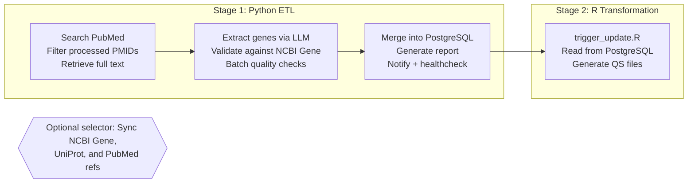

# Cerebral SVD Dashboard

[](https://opensource.org/licenses/MIT)
[](mailto:mathieu.poirier@icm-institute.org)
[](https://cran.r-project.org/)
[](https://shiny.rstudio.com/)
[](https://www.python.org/)
[](https://www.postgresql.org/)

[](#testing)
[](#testing)

An interactive R Shiny dashboard for exploring putative causal genes and clinical trial drugs for cerebral small vessel disease (cSVD), developed at the Paris Brain Institute (ICM).

---

## Table of Contents

- [Overview](#overview)
- [Technology Stack](#technology-stack)
- [Features](#features)
- [Project Structure](#project-structure)
- [Quick Start](#quick-start)
- [Installation](#installation)
- [Development](#development)
- [Environment Variables](#environment-variables)
- [Usage](#usage)
- [Deployment](#deployment)
- [HPC Pipeline App](#hpc-pipeline-app)
- [HPC Probe Explorer](#hpc-probe-explorer)
- [Fine-Tuning Loop](#fine-tuning-loop)
- [Data Pipeline](#data-pipeline)
- [LLM Configuration](#llm-configuration)
- [Data Sources](#data-sources)
- [Clinical Trials Visualization](#clinical-trials-visualization)
- [Clinical Trials Map](#clinical-trials-map)
- [Testing](#testing)
- [Performance Features](#performance-features)
- [Documentation](#documentation)
- [Contributing](#contributing)
- [License](#license)
- [Contact](#contact)
- [Acknowledgments](#acknowledgments)

---

## Overview

This dashboard provides up-to-date and standardized information on:

- Putative cerebral SVD causal genes
- Drugs tested in planned or ongoing cerebral SVD clinical trials

---

## Technology Stack

<p align="center">
<a href="https://www.r-project.org/"></a>
<a href="https://github.com/rstudio/shiny"></a>
<a href="https://www.python.org/"></a>
<a href="https://github.com/twbs/bootstrap"></a>
<a href="https://github.com/Rdatatable/data.table"></a>
<a href="https://github.com/rstudio/DT"></a>
<a href="https://github.com/rstudio/leaflet"></a>
<a href="https://github.com/atomiks/tippyjs"></a>
<a href="https://www.anthropic.com/claude"></a>
<a href="https://github.com/pydantic/pydantic"></a>
<a href="https://github.com/unionai-oss/pandera"></a>
<a href="https://github.com/pandas-dev/pandas"></a>
<a href="https://github.com/encode/httpx"></a>
<a href="https://github.com/biopython/biopython"></a>
<a href="https://github.com/pymupdf/PyMuPDF"></a>
<a href="https://github.com/MagicStack/asyncpg"></a>
<a href="https://www.postgresql.org/"></a>
<a href="https://github.com/sqlalchemy/alembic"></a>
<a href="https://www.docker.com/"></a>
<a href="https://caddyserver.com/"></a>
<a href="https://github.com/Textualize/rich"></a>
<a href="https://github.com/r-lib/testthat"></a>
<a href="https://github.com/pytest-dev/pytest"></a>
<a href="https://github.com/astral-sh/ruff"></a>
<a href="https://github.com/astral-sh/ty"></a>
<a href="https://github.com/r-lib/lintr"></a>
</p>

| Layer | Technology |
| ------- | ----------- |
| Dashboard Framework | [R 4.5+](https://www.r-project.org/), [Shiny](https://github.com/rstudio/shiny), [bslib](https://github.com/rstudio/bslib) (Bootstrap 5) |
| Frontend UI | [DT](https://github.com/rstudio/DT) (DataTables), [shinyWidgets](https://github.com/dreamRs/shinyWidgets), [Tippy.js](https://github.com/atomiks/tippyjs), [Popper.js](https://github.com/floating-ui/floating-ui) |
| Mapping | [Leaflet](https://github.com/rstudio/leaflet), [tidygeocoder](https://github.com/jessecambon/tidygeocoder) (OpenStreetMap Nominatim) |
| Visualization | Custom SVG ([python_plot.py](scripts/python_plot.py)), [Leaflet](https://github.com/rstudio/leaflet) marker clusters |
| Data Processing (R) | [data.table](https://github.com/Rdatatable/data.table), [fastmap](https://github.com/r-lib/fastmap), [memoise](https://github.com/r-lib/memoise), [cachem](https://github.com/r-lib/cachem), [qs](https://github.com/qsbase/qs) |
| Data Processing (Python) | [pandas](https://github.com/pandas-dev/pandas), [Pydantic v2](https://github.com/pydantic/pydantic), [Pandera](https://github.com/unionai-oss/pandera) |
| LLM Extraction | [Anthropic Claude Opus 4.7](https://platform.claude.com/docs/en/about-claude/models/migration-guide) (streaming with adaptive thinking) |
| ETL Pipeline | [Python 3.14+](https://www.python.org/), [httpx](https://github.com/encode/httpx), [Biopython](https://github.com/biopython/biopython), [lxml](https://github.com/lxml/lxml), [PyMuPDF](https://github.com/pymupdf/PyMuPDF), [Rich](https://github.com/Textualize/rich) |
| Bioinformatics (R) | [biomaRt](https://bioconductor.org/packages/biomaRt/), [UniprotR](https://github.com/Proteomicslab57357/UniprotR), [rentrez](https://github.com/ropensci/rentrez), [RefManageR](https://github.com/ropensci/RefManageR) |
| Database | [PostgreSQL 18+](https://www.postgresql.org/), [asyncpg](https://github.com/MagicStack/asyncpg), [RPostgres](https://github.com/r-dbi/RPostgres), [Alembic](https://github.com/sqlalchemy/alembic) |
| Containerization | [Docker](https://www.docker.com/) + [docker compose](https://docs.docker.com/compose/) ([rocker/shiny](https://github.com/rocker-org/rocker-versioned2)) |
| Reverse Proxy | [Caddy](https://caddyserver.com/) (fronts Cloudflare Origin CA cert) |
| Testing | [testthat](https://github.com/r-lib/testthat), [shinytest2](https://github.com/rstudio/shinytest2), [pytest](https://github.com/pytest-dev/pytest) |
| Linting & Type Checking | [Ruff](https://github.com/astral-sh/ruff), [ty](https://github.com/astral-sh/ty), [lintr](https://github.com/r-lib/lintr) |

---

## Features

### Gene Table

Browse putative causal genes with filters for:

- Mendelian Randomization status
- GWAS traits — the 23 canonical cSVD phenotypes defined in
  `pipeline/config.py:VALID_GWAS_TRAITS`: WMH, DWMH, PVWMH, SVS, BG-PVS,
  WM-PVS, HIP-PVS, PSMD, MD, extreme-cSVD, FA, lacunes, stroke,
  cerebral-microbleeds, ICH-lobar, ICH-non-lobar, DTI-ALPS, ICVF, ISOVF, OD,
  WMH-cortical-atrophy, WM-BAG, retinal-vessels
- Evidence from other omics studies (EWAS, TWAS, PWAS, Proteomics, MENTR)

Includes linked data from:

- NCBI Gene (with gene ID, protein, and aliases)
- UniProt (with accession numbers)
- OMIM (with phenotype, inheritance, gene/locus)
- PubMed references (with publication details)

### Clinical Trials Table

Explore drugs in clinical trials with filters for:

- Genetic evidence
- Trial registry (ClinicalTrials.gov, ISRCTN, ANZCTR, ChiCTR)
- Clinical trial phase (I, II, III)
- SVD population (CAA, Cognitive Impairment, Stroke, SVD)
- Target sample size
- Sponsor type (Academic, Industry)

### Phenogram

Interactive chromosome ideogram visualization of GWAS phenotypes.

### Clinical Trials Visualization

Interactive SVG sunburst visualization of SVD drugs tested in clinical trials.

### Clinical Trials Map

Interactive Leaflet map displaying global research sites for NCT-registered trials:

- Fetches trial locations from ClinicalTrials.gov API v2
- Geocodes locations using OpenStreetMap Nominatim (via tidygeocoder)
- Marker clustering for improved performance at low zoom levels
- Rich HTML popups with trial metadata (drug, phase, sponsor, status, sample size)
- Color-coded status badges (recruiting, active, completed, terminated)
- Direct links to ClinicalTrials.gov trial pages
- Lazy loading (data fetched only when tab accessed)
- Cached geocoded data with SHA256 integrity verification

---

## Project Structure

<details>
<summary><strong>Click to expand project structure</strong></summary>

```text
rshiny_dashboard/
├── .env.example                  # Example pipeline environment variables
├── .Renviron.example             # Example R environment variables
├── app.R                         # Main application entry point
├── Caddyfile                     # Reverse proxy config (Cloudflare Origin CA cert)
├── conftest.py                   # Root pytest config (adds project root to sys.path)
├── docker-compose.yml            # Dashboard + Postgres + pipeline + Caddy stack
├── Dockerfile                    # Dashboard Docker build
├── Dockerfile.pipeline           # Pipeline Docker build
├── LICENSE                       # MIT License
├── Makevars                      # R compilation flags (OpenMP/clang) for macOS (arm64)
├── pyproject.toml                # Python tooling config (ruff, pytest, ty)
├── README.md                     # Project documentation
├── R_PACKAGE_MANIFEST.md         # Canonical R dependency list
├── renv.lock                     # R dependency lockfile (used by Docker)
├── requirements.txt              # Python dependencies (version floors)
├── requirements.lock             # Pinned Python deps (uv-managed)
├── uv.lock                       # uv resolver lockfile
├── R/
│   ├── clean_table1.R            # Table 1 data cleaning
│   ├── clean_table2.R            # Table 2 data cleaning
│   ├── constants.R               # Application-wide constants
│   ├── data_prep.R               # Data loading and preprocessing
│   ├── fetch_trial_locations.R   # Trial location fetching and geocoding
│   ├── filter_utils.R            # Unified filter utilities for data.table
│   ├── mod_checkbox_filter.R     # Shiny module for checkbox filters
│   ├── read_external_data.R      # External data reading from database cache
│   ├── server.R                  # Main server orchestrator
│   ├── server_map.R              # Clinical Trials Map server logic
│   ├── server_table1.R           # Gene Table server logic
│   ├── server_table2.R           # Clinical Trials Table server logic
│   ├── tooltips.R                # Tooltip generation for tables
│   ├── ui.R                      # UI definition with Bootstrap 5
│   └── utils.R                   # CSS styles, DB utilities, column cleaning
├── data/                         # App data files (gitignored)
│   ├── bibentry/                 # PubMed bibliography entries
│   │   ├── bib/                  # .bib bibliography files
│   │   └── xml/                  # MODS XML reference files
│   ├── csv/                      # CSV exports
│   └── qs/                       # QS serialized files (read by Shiny at runtime)
├── docs/                         # Technical documentation
│   ├── dashboard-overview.md             # Dashboard architecture reference
│   ├── python-etl-pipeline.md            # ETL pipeline documentation
│   ├── pipeline-security.md              # Security audit and threat model
│   ├── hpc-pipeline-app-runtime.md       # HPC pipeline-app runtime contract
│   ├── icm-hpc-finetuning-stack.md       # HPC fine-tuning stack (canonical)
│   └── icm-hpc-finetuning-stack-plain.md # HPC fine-tuning stack (plain English)
├── logs/                         # Pipeline execution logs (gitignored)
├── sql/                          # PostgreSQL init scripts (bind-mounted into postgres)
│   ├── 01_setup.sql                     # Core database schema
│   └── 02_add_external_data_tables.sql  # Cache table schema
├── pipeline/                     # Python ETL pipeline
│   ├── __init__.py               # Package marker
│   ├── alembic.ini               # Alembic migration config
│   ├── batch_validation.py       # Pandera batch quality checks
│   ├── cache_utils.py            # LRU cache eviction utilities
│   ├── clinical_trials_fetch.py  # ClinicalTrials.gov API fetch
│   ├── config.py                 # Centralized configuration with env overrides
│   ├── data_merger.py            # Data transformation & database loading
│   ├── database.py               # Async PostgreSQL operations
│   ├── event_log.py              # Structured event logging (SQLite-backed)
│   ├── external_data_sync.py     # External data synchronization
│   ├── healthcheck.py            # Pipeline health checks (Healthchecks.io)
│   ├── http_client.py            # Shared HTTP client (AsyncHttpClientManager)
│   ├── llm_extraction.py         # LLM-based gene extraction orchestration
│   ├── main.py                   # CLI entry point & pipeline orchestrator
│   ├── ncbi_gene_fetch.py        # NCBI Gene data fetching
│   ├── notifications.py          # Apprise-based pipeline notifications
│   ├── pdf_retrieval.py          # Multi-source text retrieval (PMC/Unpaywall/Abstract)
│   ├── prompts.py                # LLM prompt templates with prompt caching
│   ├── pubmed_citations.py       # PubMed citation handling
│   ├── pubmed_search.py          # PubMed literature search via Entrez
│   ├── quality_metrics.py        # Pipeline statistics tracking
│   ├── rate_limiter.py           # Token-bucket rate limiter (RPM/TPM)
│   ├── report.py                 # JSON/Rich CLI report generation
│   ├── tuning_schema.py          # Pydantic models for tuning runs
│   ├── uniprot_fetch.py          # UniProt data fetching
│   ├── validation.py             # NCBI gene verification & confidence filtering
│   ├── alembic/                  # Database migrations (Alembic)
│   │   ├── env.py                # Alembic environment config
│   │   ├── script.py.mako        # Migration script template
│   │   └── versions/             # Migration version scripts
│   │       ├── 001_baseline_schema.py        # Initial database schema
│   │       ├── 002_add_upper_gene_index.py   # Upper gene name index
│   │       └── 003_add_pipeline_runs_table.py  # Pipeline runs audit table
│   ├── llm_providers/            # Pluggable LLM provider abstraction
│   │   ├── __init__.py           # Package marker
│   │   ├── base.py               # Provider protocol + GeneEntry/ExtractionResult Pydantic models
│   │   └── anthropic_provider.py # Claude/Anthropic implementation (streaming + adaptive thinking)
│   └── templates/                # Jinja2 notification templates
│       └── digest.md.j2          # Markdown notification template
├── pipeline_app/                 # NiceGUI local pipeline app (port 8080)
│   ├── __init__.py               # Package marker
│   ├── config.json               # Persisted non-sensitive app config
│   ├── config.py                 # Config dataclasses and persistence
│   ├── main.py                   # NiceGUI entry point and route registration
│   ├── runner.py                 # Subprocess runner for pipeline and tuning
│   ├── theme.py                  # Shared dark theme
│   ├── tuning_config.json        # Persisted tuning preset config
│   ├── components/               # Reusable UI elements
│   │   ├── __init__.py           # Package marker
│   │   ├── async_loader.py       # Helper for async data loading
│   │   ├── button_loading.py     # Button with loading state
│   │   ├── confirm_dialog.py     # Confirmation dialog
│   │   ├── empty_state.py        # Empty state placeholder
│   │   ├── execution_panel.py    # Pipeline execution panel
│   │   ├── file_content.py       # File content viewer
│   │   ├── form_fields.py        # Reusable form field helpers
│   │   ├── fs_nav.py             # Filesystem navigation
│   │   ├── log_viewer.py         # Log viewer with severity filters
│   │   ├── path_picker.py        # Path picker dialog
│   │   ├── preset_dialog.py      # Preset save/load dialog
│   │   ├── preset_selector.py    # Preset selector widget
│   │   ├── stage_tracker.py      # Pipeline stage progress tracker
│   │   ├── stat_card.py          # Statistic display card
│   │   └── table_utils.py        # Table rendering utilities
│   ├── pages/                    # Application pages
│   │   ├── __init__.py           # Package marker
│   │   ├── configure_run.py      # Configure & Run page
│   │   ├── file_browser.py       # File Browser page
│   │   ├── results_viewer.py     # Results Viewer page
│   │   ├── run_history.py        # Run History page
│   │   ├── tuning.py             # Tuning page (6-stage workflow)
│   │   └── tuning_history.py     # Tuning History page
│   └── static/                   # Static assets
│       └── theme.css             # Theme stylesheet
├── pipeline_app_hpc/             # NiceGUI HPC pipeline app (port 8081)
│   ├── __init__.py               # Package marker
│   ├── README.md                 # HPC pipeline-app readme
│   ├── cli.py                    # Headless CLI entrypoint (`python -m pipeline_app_hpc.cli`)
│   ├── config.json               # Persisted non-sensitive app config
│   ├── config.py                 # Config dataclasses (SSH, vLLM, sbatch)
│   ├── extract.py                # Extraction orchestration (HPC variant)
│   ├── main.py                   # NiceGUI entry point + bounded shutdown
│   ├── runner.py                 # HPC-aware pipeline + tuning runner
│   ├── theme.py                  # Shared dark theme
│   ├── components/               # HPC-specific UI elements
│   │   ├── __init__.py           # Package marker
│   │   ├── hpc_card.py           # HPC connection / vLLM status card
│   │   └── preset_selector.py    # Preset selector widget
│   ├── hpc/                      # HPC orchestration layer
│   │   ├── __init__.py           # Package marker
│   │   ├── lifecycle.py          # VllmServer state machine
│   │   ├── readiness.py          # vLLM HTTP readiness polling
│   │   ├── sbatch.py             # Slurm submission + status polling
│   │   ├── ssh.py                # SshControlMaster (single-conn multiplexing)
│   │   └── tunnel.py             # Local-port → remote vLLM tunnel
│   ├── pages/                    # Application pages (mirrors pipeline_app/)
│   │   ├── __init__.py           # Package marker
│   │   ├── _helpers.py           # Shared page helpers
│   │   ├── configure_run.py      # Configure & Run (with HPC card)
│   │   ├── file_browser.py       # File Browser page
│   │   ├── results_viewer.py     # Results Viewer page
│   │   ├── run_history.py        # Run History page
│   │   ├── tuning.py             # Tuning page
│   │   └── tuning_history.py     # Tuning History page
│   ├── providers/                # HPC LLM provider
│   │   ├── __init__.py           # Package marker
│   │   └── vllm_provider.py      # OpenAI-compatible client targeting tunneled vLLM
│   └── sbatch/                   # Slurm submission templates
│       └── vllm_serve.sbatch.j2  # vLLM serve job template
├── scripts/
│   ├── __init__.py               # Package marker
│   ├── bib_to_xml.R              # Convert .bib files to MODS XML
│   ├── distill_pubmed_keywords.py  # Distill PubMed keywords from MODS XML bibliography
│   ├── plot_tuning_runs.R        # Tuning experiment visualization
│   ├── python_plot.py            # Clinical trials visualization generator
│   ├── run_pipeline.sh           # Weekly cron wrapper (pipeline + trigger + restart)
│   ├── trigger_update.R          # Regenerate QS files from database
│   ├── validate_pipeline.py      # Pipeline validation script
│   ├── finetune/                 # QLoRA fine-tuning loop (Mac → ICM HPC)
│   │   ├── __init__.py           # Package marker
│   │   ├── build_dataset.py      # Builds MLX-LM JSONL from pipeline logs + PDFs (runs on Mac)
│   │   ├── train_unsloth.py      # QLoRA fine-tune on HPC via Unsloth + TRL
│   │   ├── icm_finetune.sbatch   # Main fine-tune Slurm script
│   │   ├── icm_fa2_build.sbatch  # FlashAttention 2 wheel build
│   │   └── icm_smoke.sbatch      # Adapter smoke test
│   └── tuning/                   # Threshold calibration experiments
│       ├── __init__.py           # Package marker
│       ├── analyze_errors.py     # Error analysis
│       ├── calibrate_threshold.py  # Threshold calibration
│       ├── track_run.py          # Experiment run tracking
│       ├── run_experiment.sh     # Experiment runner (bash)
│       └── run_experiment.completion.zsh  # Zsh tab-completion
├── tests/
│   ├── test_all.R                # R test suite — 102 tests (testthat + shinytest2)
│   ├── pipeline/                 # ETL pipeline pytest suite — 543 tests
│   │   ├── conftest.py           # Shared fixtures
│   │   ├── test_anthropic_provider.py        # Tests for anthropic_provider.py
│   │   ├── test_batch_validation.py          # Tests for batch_validation.py
│   │   ├── test_build_dataset.py             # Tests for scripts/finetune/build_dataset.py
│   │   ├── test_clinical_trials_fetch.py     # Tests for clinical_trials_fetch.py
│   │   ├── test_clinical_trials_pipeline.py  # Tests for CT pipeline orchestration
│   │   ├── test_config.py                    # Tests for config.py
│   │   ├── test_data_merger.py               # Tests for data_merger.py
│   │   ├── test_database.py                  # Tests for database.py
│   │   ├── test_event_log.py                 # Tests for event_log.py
│   │   ├── test_external_data_sync.py        # Tests for external_data_sync.py
│   │   ├── test_healthcheck.py               # Tests for healthcheck.py
│   │   ├── test_llm_extraction.py            # Tests for llm_extraction.py
│   │   ├── test_llm_extraction_dispatch.py   # Tests for provider dispatch
│   │   ├── test_llm_providers_base.py        # Tests for llm_providers/base.py
│   │   ├── test_main.py                      # Tests for main.py
│   │   ├── test_ncbi_gene_fetch.py           # Tests for ncbi_gene_fetch.py
│   │   ├── test_notification_config.py       # Tests for notification config
│   │   ├── test_notifications.py             # Tests for notifications.py
│   │   ├── test_pdf_retrieval.py             # Tests for pdf_retrieval.py
│   │   ├── test_prompts.py                   # Tests for prompts.py
│   │   ├── test_pubmed_citations.py          # Tests for pubmed_citations.py
│   │   ├── test_pubmed_search.py             # Tests for pubmed_search.py
│   │   ├── test_quality_metrics.py           # Tests for quality_metrics.py
│   │   ├── test_rate_limiter.py              # Tests for rate_limiter.py
│   │   ├── test_report.py                    # Tests for report.py
│   │   ├── test_uniprot_fetch.py             # Tests for uniprot_fetch.py
│   │   └── test_validation.py                # Tests for validation.py
│   ├── pipeline_app/             # NiceGUI pipeline-app pytest suite — 413 tests, 17 files
│   │   ├── conftest.py                   # Shared fixtures (tmp_config_dir)
│   │   ├── test_config.py                # Tests for pipeline_app/config.py
│   │   ├── test_empty_state.py           # Tests for empty_state component
│   │   ├── test_file_browser.py          # Tests for File Browser page
│   │   ├── test_file_content.py          # Tests for file_content component
│   │   ├── test_fs_nav.py                # Tests for fs_nav component
│   │   ├── test_log_viewer_severity.py   # Tests for log_viewer severity filter
│   │   ├── test_main.py                  # Tests for pipeline_app/main.py
│   │   ├── test_main_breadcrumbs.py      # Tests for main breadcrumbs
│   │   ├── test_path_picker.py           # Tests for path_picker component
│   │   ├── test_results_viewer.py        # Tests for Results Viewer page
│   │   ├── test_runner.py                # Tests for runner.py
│   │   ├── test_runner_args.py           # Tests for runner CLI arg building
│   │   ├── test_stage_tracker.py         # Tests for stage_tracker component
│   │   ├── test_stat_card.py             # Tests for stat_card component
│   │   ├── test_theme.py                 # Tests for theme
│   │   ├── test_tuning_history.py        # Tests for Tuning History page
│   │   └── test_tuning_runner.py         # Tests for TuningRunner
│   ├── pipeline_app_hpc/         # HPC pipeline-app pytest suite — 130 tests, 15 files
│   │   ├── conftest.py
│   │   └── test_*.py             # Covers CLI, config, extract, HPC card, integration, lifecycle, main, readiness, runner, sbatch (+ template), SSH, tuning runner, tunnel, vLLM provider
│   └── scripts/                  # Standalone-scripts pytest suite — 144 tests
│       ├── fixtures/             # JATS XML + MeSH samples loaded by path (not network)
│       └── test_*.py             # Currently covers scripts/distill_pubmed_keywords.py
└── www/                          # Static web assets
    ├── custom.css                # Custom styles (source)
    ├── custom.js                 # Custom JavaScript (source)
    ├── phenogram_template.html   # Interactive phenogram viewer
    ├── python_plot.html          # Clinical trials visualization
    ├── python_plot.js            # Plot interactivity and sidepanel
    ├── css/                      # Vendor CSS
    │   └── tippy.css             # Tooltip styles
    ├── fonts/                    # Local web fonts
    │   ├── Inter-Regular.ttf     # Inter Regular
    │   ├── Inter-Regular.woff2   # Inter Regular (WOFF2)
    │   ├── Inter-Medium.ttf      # Inter Medium
    │   ├── Inter-Medium.woff2    # Inter Medium (WOFF2)
    │   ├── Inter-SemiBold.ttf    # Inter SemiBold
    │   ├── Inter-SemiBold.woff2  # Inter SemiBold (WOFF2)
    │   ├── Inter-Bold.ttf        # Inter Bold
    │   ├── Inter-Bold.woff2      # Inter Bold (WOFF2)
    │   ├── Raleway-Regular.ttf   # Raleway Regular
    │   └── Raleway-Bold.ttf      # Raleway Bold
    ├── images/                   # Logos and visual assets
    │   ├── ICM-logo.svg          # ICM logo (SVG)
    │   ├── icm_logo.png          # ICM logo (PNG)
    │   ├── icm_logo.webp         # ICM logo (WebP)
    │   ├── phenogram.png         # Phenogram graphic (PNG)
    │   └── phenogram.webp        # Phenogram graphic (WebP)
    └── js/                       # Vendor JavaScript
        ├── popper.min.js         # Popper.js positioning library
        └── tippy.min.js          # Tippy.js tooltip library
```

</details>

---

## Quick Start

```bash
# 1. Clone the repository
git clone https://github.com/mathieubpoiriericm/icm-dashboard.git
cd icm-dashboard

# 2. Install R dependencies — preferred: restore from the lockfile
Rscript -e 'renv::restore()'
# (or, for a minimal manual install, see the Installation section below)

# 3. Install the maRco helper package
Rscript -e 'devtools::install("maRco")'

# 4. Run the app
Rscript -e 'shiny::runApp()'
```

The dashboard will open in your browser at `http://127.0.0.1:3838`.

---

## Installation

### Prerequisites

**For running the Shiny app only:**

- R 4.5+
- The `maRco` helper package

**For running the data pipeline:**

- Python 3.14+
- PostgreSQL 18+

### Install R Dependencies

```r
# Install maRco package (required for data fetching/cleaning)
devtools::install("maRco")
```

<details>
<summary><strong>Click to expand full R package list</strong></summary>

The canonical R dependency list lives in
[`R_PACKAGE_MANIFEST.md`](R_PACKAGE_MANIFEST.md) (generated from the
source files). For reproducible builds the Docker image restores from
`renv.lock`; for local installs:

```r
# Install required CRAN packages
install.packages(c(
  "bslib",
  "cachem",
  "data.table",
  "DBI",
  "digest",
  "dplyr",
  "DT",
  "fastmap",
  "future",
  "future.apply",
  "ggplot2",
  "ggrepel",
  "ggtext",
  "htmltools",
  "httr2",
  "jsonlite",
  "leaflet",
  "memoise",
  "parallelly",
  "patchwork",
  "purrr",
  "qs",
  "ragg",
  "readr",
  "RPostgres",
  "scales",
  "shiny",
  "shinytest2",
  "shinyWidgets",
  "showtext",
  "stringr",
  "sysfonts",
  "systemfonts",
  "testthat",
  "tidygeocoder",
  "tidyr"
))
```

Visualization-only packages (`ggplot2`, `ggrepel`, `ggtext`,
`patchwork`, `ragg`, `scales`, `systemfonts`, `tidyr`) are required by
`scripts/plot_tuning_runs.R` but not by the dashboard itself; you can
omit them if you don't run the tuning plots.

> `devtools::install("maRco")` brings in additional bioinformatics
> packages (`rentrez`, `RefManageR`, `rbibutils`, plus Bioconductor's
> `biomaRt` and `UniprotR`) transitively via maRco's `DESCRIPTION` —
> they aren't required to launch the Shiny app but are needed by the
> ETL helpers in the maRco package.

</details>

### Install Python Dependencies (for data pipeline)

```bash
pip install -r requirements.txt
```

<details>
<summary><strong>Click to expand Python package list</strong></summary>

```txt
# HTTP client (async)
httpx>=0.24.0

# XML parsing
lxml>=4.9.0
lxml-stubs>=0.5.1

# LLM API
anthropic>=0.25.0

# Data validation
pydantic>=2.0.0

# Batch validation
pandera>=0.18.0

# DataFrame operations
pandas>=2.0.0

# Bioinformatics
biopython>=1.81

# Database
asyncpg>=0.28.0

# Database migrations
alembic>=1.15.0
psycopg2-binary>=2.9.0
sqlalchemy>=2.0.0

# Environment variables
python-dotenv>=1.0.0

# CLI tab-completion
argcomplete>=3.0.0

# CLI output formatting
rich>=13.0.0

# PDF extraction (optional)
PyMuPDF>=1.23.0

# Notifications
apprise>=1.9.7
tenacity>=9.1.4
jinja2>=3.1.6

# Analysis & visualization (tuning scripts)
matplotlib>=3.8.0
scikit-learn>=1.4.0

# NiceGUI framework (pipeline app + HPC pipeline app)
nicegui>=2.0.0

# Dev tools — linting & type-checking
ruff>=0.9.0
ty>=0.0.1a0
```

For reproducible builds, pinned versions are captured in
`requirements.lock` and `uv.lock` (used by `uv` and the Docker
pipeline image).

</details>

<details>
<summary><strong>Click to expand database setup instructions</strong></summary>

### Database Setup (for data pipeline)

1. Install PostgreSQL 18
2. Create a database and user:

   ```sql
   CREATE USER csvd_user WITH PASSWORD 'your_password';
   CREATE DATABASE csvd_dashboard OWNER csvd_user;
   ```

3. Initialize the schema:

   ```bash
   # Initialize core schema
   psql -U csvd_user -d csvd_dashboard -f sql/01_setup.sql

   # Add external data cache tables
   psql -U csvd_user -d csvd_dashboard -f sql/02_add_external_data_tables.sql
   ```

   (Under the docker-compose deployment these are applied automatically on
   first boot — `sql/` is bind-mounted into the `postgres` container at
   `/docker-entrypoint-initdb.d`.)

</details>

---

## Development

### Linting and formatting

Python (the `pipeline/`, `pipeline_app/`, `pipeline_app_hpc/`,
`scripts/`, `tests/` trees):

```bash
ruff check pipeline pipeline_app pipeline_app_hpc scripts tests   # Lint
ruff format pipeline pipeline_app pipeline_app_hpc scripts tests  # Format
ruff check --fix pipeline pipeline_app pipeline_app_hpc scripts   # Auto-fix
ty check pipeline pipeline_app pipeline_app_hpc scripts           # Type-check
```

R:

```bash
Rscript -e 'lintr::lint_dir("R/")'        # All R files
Rscript -e 'lintr::lint("R/some_file.R")'  # Single file
```

Markdown:

```bash
/opt/homebrew/bin/markdownlint-cli2 "**/*.md"
```

Config for all of the above lives in `pyproject.toml` (ruff/ty), `.lintr`,
and `.markdownlint-cli2.yaml`. The `icm-hpc/` tree is a separate
HPC-side project with its own `pyproject.toml` (Python `>=3.12,<3.13`)
and is **not** linted from the host venv.

---

## Environment Variables

<details>
<summary><strong>Click to expand environment variables table</strong></summary>

| Variable | Description | Required For |
| ---------- | ------------- | -------------- |
| `DB_HOST` | PostgreSQL host | Pipeline / live data |
| `DB_PORT` | PostgreSQL port (default: 5432) | Pipeline / live data |
| `DB_NAME` | Database name | Pipeline / live data |
| `DB_USER` | Database username | Pipeline / live data |
| `DB_PASSWORD` | Database password | Pipeline / live data |
| `ANTHROPIC_API_KEY` | Anthropic API key for LLM extraction | Pipeline only |
| `NCBI_API_KEY` | NCBI Entrez API key | Pipeline only |
| `ENTREZ_EMAIL` | Email for NCBI Entrez API (required by NCBI policy) | Pipeline only |
| `UNPAYWALL_EMAIL` | Email for Unpaywall open-access PDF API | Pipeline only |
| `PRELOAD_TABLE2` | Set to `FALSE` to disable Table 2 preloading (default: `TRUE`) | Docker/memory optimization |

Any field on `pipeline/config.py:PipelineConfig` can be overridden via a
`PIPELINE_*` env var. The most commonly tuned ones:

| Variable | Default | Description |
| -------- | ------- | ----------- |
| `PIPELINE_LLM_PROVIDER` | `anthropic` | Provider key (reserved for future providers) |
| `PIPELINE_LLM_MODEL` | `claude-opus-4-7` | Model identifier |
| `PIPELINE_LLM_EFFORT` | `high` | Adaptive thinking effort (`low` / `high` / `max`) |
| `PIPELINE_PROMPT_VERSION` | `v5` | Prompt template version (A/B tuning) |
| `PIPELINE_CONFIDENCE_THRESHOLD` | `0.65` | Minimum LLM confidence to retain a gene |
| `PIPELINE_RPM_LIMIT` / `PIPELINE_TPM_LIMIT` | `50` / `100000` | Rate limiter buckets |
| `PIPELINE_MAX_CONCURRENT_PAPERS` | `5` | Parallel paper processing |
| `PIPELINE_CT_*` | various | Clinical-trials fetch tuning (`PAGE_SIZE`, `MAX_CONCURRENCY`, `MAX_RETRIES`, `SEARCH_TERMS`) |
| `PIPELINE_DB_POOL_MIN` / `PIPELINE_DB_POOL_MAX` | `2` / `10` | asyncpg connection pool sizing |
| `PIPELINE_NOTIFY_URLS` | `""` | Comma-separated Apprise URLs (ntfy/Gmail) |
| `PIPELINE_HEALTHCHECK_URL` | `""` | Healthchecks.io dead-man's-switch URL |

See `pipeline/config.py` for the full set (~25 variables total).

</details>

---

## Usage

Run the Shiny dashboard:

```r
shiny::runApp()                       # http://127.0.0.1:3838
```

Or from the command line:

```bash
Rscript -e "shiny::runApp()"
```

Run the pipeline operator UIs:

```bash
python pipeline_app/main.py       # local pipeline      — http://127.0.0.1:8080
python pipeline_app_hpc/main.py   # HPC pipeline        — http://127.0.0.1:8081
```

Run the ETL pipeline directly (see [Data Pipeline](#data-pipeline)
for the full CLI):

```bash
python pipeline/main.py                                     # PubMed, default 7-day window
python pipeline/main.py --pubmed --clinical-trials --sync-external-data
```

---

## Deployment

### Local Development

```r
shiny::runApp()
```

### Production (docker compose)

The full deployment is four services in one `docker-compose.yml`: the
Shiny `dashboard`, a `postgres` database, a one-shot `pipeline` service
(guarded by the `run` compose profile), and a `caddy` reverse proxy
serving a Cloudflare Origin CA certificate for traffic coming through
Cloudflare Access.

**Prerequisites:**

- Docker 20.10+ with the Compose V2 plugin
- Cloudflare Origin CA certificate + key (from Cloudflare dashboard →
  SSL/TLS → Origin Server → Create Certificate)
- `.env` with `DB_USER`, `DB_PASSWORD`, `DB_NAME`, `DB_HOST=postgres`,
  `ANTHROPIC_API_KEY`, `NCBI_API_KEY`, `ENTREZ_EMAIL`, `UNPAYWALL_EMAIL`
- `.Renviron` with the same DB + NCBI vars (read by `trigger_update.R`)

**Steps:**

```bash
# 1. Place your Cloudflare Origin CA cert and key in ./certs/
mkdir -p certs
# (put origin.pem and origin.key in certs/; gitignored)

# 2. Build images (local — no registry)
docker build -t rshiny-dashboard:3.0.0 .
docker build -f Dockerfile.pipeline -t svd-pipeline:3.0.0 .

# 3. Start the long-running services
docker compose up -d
# brings up: dashboard, postgres, caddy

# 4. Seed data (first run only)
./scripts/run_pipeline.sh
# runs pipeline + sync-external + trigger_update + restart dashboard

# 5. Install the weekly cron line (replace <repo> with the absolute path)
echo "0 3 * * 1 /<repo>/scripts/run_pipeline.sh" | crontab -
```

**Cloudflare Access:** Caddy listens on `:443` with the Origin CA cert
(`Caddyfile` specifies the hostname and cert paths). Point Cloudflare at
the server's public IP (or use `cloudflared` alongside); Zero Trust
policies are unchanged from the previous deployment.

**Two-tier ingress:** Public 443 traffic does not land on this host
directly. It arrives at a separate Proxmox gateway VM running
Traefik v3, which terminates Cloudflare's TLS and reverse-proxies
per-hostname over the LAN to the Caddy service shown above. The same
Cloudflare Origin CA certificate is presented at both tiers, and
Traefik's upstream transport sets `serverName` to the dashboard
hostname so Caddy's single site block matches the SNI.

**Volumes:**

| Volume | Owner | Purpose |
| --- | --- | --- |
| `qs_data` (named) | Pipeline writes, Dashboard reads | Binary QS files bridging pipeline → app |
| `postgres_data` (named) | Postgres | Database data directory |
| `caddy_data`, `caddy_config` (named) | Caddy | Proxy state |
| `./logs` (bind) | Pipeline | Timestamped cron + pipeline logs |
| `./sql` (bind, RO) | Postgres | First-boot `docker-entrypoint-initdb.d` schema |
| `./certs` (bind, RO) | Caddy | Cloudflare Origin CA cert + key |

**Weekly schedule:** `scripts/run_pipeline.sh` chains the scheduled refresh and
writes a log per invocation at `logs/cron_<ts>.log`:

1. `docker compose run --rm --entrypoint sh pipeline -c "python pipeline/main.py --pubmed --sync-external-data --days-back 7 && Rscript scripts/trigger_update.R"`
2. `docker compose restart dashboard` (dashboard re-reads `qs_data`)

**Notifications / observability:** disabled by design. The pipeline
supports Apprise-based notifications and Healthchecks.io pings, but the
current deployment keeps things minimal — logs only.

---

## HPC Pipeline App

`pipeline_app_hpc/` is a NiceGUI dev/operator UI (port **8081**) that
runs the same Python ETL against the ICM HPC cluster instead of
locally. It mirrors the page structure of `pipeline_app/` (Configure &
Run, Run History, Results Viewer, Tuning, Tuning History, File
Browser) and adds an HPC card to the configure page that drives a
remote vLLM provider through Slurm.

```bash
python pipeline_app_hpc/main.py    # http://127.0.0.1:8081
python -m pipeline_app_hpc.cli     # headless invocation
```

### Runner orchestration

The HPC runner is layered on top of the local runner pattern and adds:

| Module | Responsibility |
| ------ | -------------- |
| `pipeline_app_hpc/hpc/ssh.py` | `SshControlMaster` multiplexes a single SSH connection across all HPC operations |
| `pipeline_app_hpc/hpc/sbatch.py` | Slurm submission + status polling (uses the templates under `pipeline_app_hpc/sbatch/`) |
| `pipeline_app_hpc/hpc/tunnel.py` | Local-port → remote vLLM tunnel through the SSH ControlMaster |
| `pipeline_app_hpc/hpc/readiness.py` | Waits for the vLLM HTTP endpoint to become healthy |
| `pipeline_app_hpc/hpc/lifecycle.py` | `VllmServer` state machine (snapshotted via `VllmServerSnapshot` / `VllmServerState`) |
| `pipeline_app_hpc/providers/vllm_provider.py` | OpenAI-compatible client wired into the pipeline LLM provider protocol |

Shutdown is bounded by `SHUTDOWN_TIMEOUT_SECONDS ≈ 12s` in
`pipeline_app_hpc/main.py` so Ctrl+C doesn't hang behind a stubborn
subprocess. See [`docs/hpc-pipeline-app-runtime.md`](docs/hpc-pipeline-app-runtime.md)
for the full runtime contract.

---

## HPC Probe Explorer

`hpc-explorer/` is a Vite + React 19 + TypeScript static visualization
of one ICM compute-node probe. A pre-build step parses
`icm-hpc/probing_results/master_probe_RESULTS_GPU.txt` into
`src/data/probe.ts` so the SPA can render the topology without a
backend.

```bash
cd hpc-explorer
npm install
npm run dev      # parses ../icm-hpc/probing_results/... then serves
npm run build    # static build
npm run parse    # regenerate src/data/probe.ts from the probe txt
```

---

## Fine-Tuning Loop

`scripts/finetune/` builds a chat-formatted dataset from the
pipeline's confidence-scored extractions and fine-tunes Claude-adjacent
open models with QLoRA on the ICM HPC cluster:

1. **`build_dataset.py`** — Runs on Mac. Reads
   `logs/json/pipeline_report_*.json` plus PDFs in
   `data/test_data/pdf/`, filters by confidence, and writes MLX-LM
   chat JSONL.
2. **`icm_finetune.sbatch` + `train_unsloth.py`** — QLoRA fine-tune on
   HPC via Unsloth + TRL.
3. **`icm_fa2_build.sbatch`** — Flash-Attention 2 wheel build (one-shot
   environment setup).
4. **`icm_smoke.sbatch`** — Smoke test for the trained adapter.
5. **Serving** — The resulting adapter is served from HPC via vLLM and
   consumed by the HPC pipeline app above.

> **HPC orchestration quirks** (not in the stack doc):
>
> - Working SLURM args: `--qos=qos6 --mem=64G`. (`m120_c1` QoS rejects
>   submissions with `mem ≥ 200G`.)
> - The USR1 checkpoint trap (`--signal=B:USR1@120`) saves a clean
>   adapter on time-limit. SLURM may report the job as `FAILED`
>   because bash `wait` returns 138 when interrupted — trust the
>   checkpoint, not the SLURM state.

See [`docs/icm-hpc-finetuning-stack.md`](docs/icm-hpc-finetuning-stack.md)
(canonical, with modules / package versions / NCCL config) and
[`docs/icm-hpc-finetuning-stack-plain.md`](docs/icm-hpc-finetuning-stack-plain.md)
(plain-English version).

### ICM HPC artifacts (`icm-hpc/`)

Host-side artifacts checked in for reproducibility:

- `pyproject.toml` — pinned QLoRA stack (Python `>=3.12,<3.13`, CUDA
  12.6 Torch + Unsloth + TRL + bitsandbytes). Not linted from the host
  venv.
- `probing_scripts/` — `master_probe.sh`, `finetune_stack_probe.sh`,
  `storage_probe.sh`, sbatch variants
- `probing_results/` — captured probe outputs (consumed by
  `hpc-explorer`)
- `slurm_script/`, `report/`, `support_ticket/`,
  `hpc_stack_troubleshooting/` — operational notes

---

## Data Pipeline

The dashboard uses a two-stage data pipeline: a Python ETL pipeline that extracts gene data from PubMed literature, followed by an R script that transforms the data into optimized QS files for the Shiny app.

### LLM provider abstraction

Extraction runs through a pluggable provider in
`pipeline/llm_providers/`. The protocol is defined in `base.py`; the
only built-in provider is `anthropic_provider.py` (Claude via the
Anthropic SDK, with streaming, adaptive thinking, and prompt
caching). HPC runs swap in a separate `VllmProvider` defined in
`pipeline_app_hpc/providers/vllm_provider.py` — an OpenAI-compatible
client that targets a tunneled vLLM endpoint. The provider is
selected at startup via `PIPELINE_LLM_PROVIDER` (default `"anthropic"`).

### Pipeline Architecture



### Running the Pipeline

#### Stage 1: Python ETL

```bash
# Standard run (search last 7 days, extract genes)
python pipeline/main.py

# Sync external data (NCBI Gene, UniProt, PubMed citations)
python pipeline/main.py --sync-external-data

# Run PubMed extraction and external sync in one invocation
python pipeline/main.py --pubmed --sync-external-data

# Extended lookback (30 days)
python pipeline/main.py --days-back 30
```

| Argument | Default | Description |
| ---------- | --------- | ------------- |
| `--days-back` | 7 | Number of days to look back for new papers (1-3650) |
| `--pubmed` | default when no selector is given | Run PubMed extraction explicitly; can be combined with online selectors |
| `--clinical-trials` | - | Discover cSVD-relevant ClinicalTrials.gov drug trials |
| `--dry-run` | - | Run pipeline without writing to database |
| `--test-mode` | - | Skip LLM extraction (test search/retrieval only) |
| `--sync-external-data` | - | Sync NCBI Gene, UniProt, and PubMed citation data; can be combined with `--pubmed` and/or `--clinical-trials` |
| `--local-pdfs PATH` | - | Extract genes from local PDF file(s) without PubMed search |
| `--pmids FILE` | - | Process specific PMIDs from text file (one per line, no database) |
| `--skip-validation` | - | Skip NCBI Gene validation (only with `--local-pdfs` or `--pmids`) |

> **Tab-completion**: `eval "$(python pipeline/main.py --complete bash)"` (also supports `zsh` and `fish`)

#### Stage 2: R Transformation

```bash
Rscript scripts/trigger_update.R
```

Reads from PostgreSQL and generates QS files for the Shiny app:

| QS File | Source | Description |
| --------- | -------- | ------------- |
| `table1_clean.qs` | `genes` table | Cleaned gene data for Table 1 |
| `table2_clean.qs` | `clinical_trials` table | Cleaned clinical trials for Table 2 |
| `gene_info_results_df.qs` | `ncbi_gene_info` cache | NCBI Gene info for Table 1 |
| `gene_info_table2.qs` | `ncbi_gene_info` cache | NCBI Gene info for Table 2 |
| `prot_info_clean.qs` | `uniprot_info` cache | UniProt protein annotations |
| `refs.qs` | `pubmed_citations` cache | Formatted PubMed references |
| `gwas_trait_names.qs` | `genes` table | GWAS trait name mappings |

> **Note:** Geocoded trial location data (`geocoded_trials.qs`) is generated at runtime by the Shiny app's map functionality (`R/fetch_trial_locations.R`), not by `trigger_update.R`.

### Notifications (optional)

The pipeline includes an optional Apprise-based notification system
(`pipeline/notifications.py`) plus a Healthchecks.io dead-man's-switch
(`pipeline/healthcheck.py`). Both are inert unless the relevant env vars
(`PIPELINE_NOTIFY_URLS`, `PIPELINE_HEALTHCHECK_URL`) are set. The
current docker-compose deployment leaves them unset — pipeline output is
kept as plain logs in `logs/cron_<ts>.log` and `logs/pipeline_*.log`.

### Automated Updates

Pipeline automation is a host crontab line that invokes
`scripts/run_pipeline.sh` weekly (default: Monday 03:00). See
[Production (docker compose)](#production-docker-compose) for the
command and the four chained steps.

---

## LLM Configuration

### What the LLM Does

Claude reads full-text cSVD research papers and extracts genes with putative causal links, outputting structured JSON with gene symbol, GWAS traits, evidence types (TWAS, PWAS, colocalization, etc.), a calibrated confidence score, and a causal evidence summary. This replaces manual curation — the LLM performs the role of a systematic reviewer, processing papers that would otherwise require domain-expert reading and data entry.

### Prompt Design

The prompt uses a two-part architecture defined in `pipeline/prompts.py`: a system prompt for role assignment and extraction instructions for the task specification.

**System prompt** (`SYSTEM_PROMPT`) — Assigns Claude the role of "a systematic reviewer specializing in cerebral small vessel disease (cSVD) genetics." The [system prompts documentation](https://docs.anthropic.com/en/docs/build-with-claude/prompt-engineering/system-prompts) recommends using the `system` parameter for role assignment, noting it provides "enhanced accuracy" in complex domain scenarios. The highly specific role follows the documentation's advice that more specific roles yield better results.

**Extraction instructions** (`EXTRACTION_INSTRUCTIONS`) — An XML-tagged structure with these components:

| Component | Purpose | Documentation Rationale |
| ----------- | --------- | ------------------------ |
| `<task>` | Clear task definition | [Be clear and direct](https://docs.anthropic.com/en/docs/build-with-claude/prompt-engineering/be-clear-and-direct): provide explicit, unambiguous instructions |
| `<inclusion_criteria>` | Enumerates evidence types (GWAS, MR, colocalization, etc.) and canonical cSVD phenotype abbreviations (WMH, SVS, BG-PVS, etc.) | Reduces ambiguity by defining the exact vocabulary the model should use |
| `<extraction_strategy>` | "Identify passages first, then extract" grounding pattern | [Long context tips](https://docs.anthropic.com/en/docs/build-with-claude/prompt-engineering/long-context-tips): "Ground responses in quotes... ask Claude to quote relevant parts first before carrying out its task." Prevents hallucination on 50K-char papers |
| `<field_guidance>` | Maps each output field to extraction rules | [Be clear and direct](https://docs.anthropic.com/en/docs/build-with-claude/prompt-engineering/be-clear-and-direct): use numbered/sequential steps to ensure correct execution |
| `<confidence_scoring>` | 4-tier rubric with anchored examples (1.0 = functional validation, 0.7–0.9 = GWAS + supporting data, etc.) | Calibrates LLM scoring with concrete anchors rather than vague guidance |
| `<examples>` | 3 few-shot examples (2 include, 1 exclude) | [Multishot prompting](https://docs.anthropic.com/en/docs/build-with-claude/prompt-engineering/multishot-prompting): "dramatically improve accuracy, consistency, and quality"; recommends 3–5 diverse examples wrapped in `<example>` tags. The exclude example (APOE as covariate) teaches the critical inclusion boundary |

**Why XML tags throughout**: The [XML tags documentation](https://docs.anthropic.com/en/docs/build-with-claude/prompt-engineering/use-xml-tags) recommends using XML tags to "clearly separate different parts of your prompt" for improved clarity, accuracy, and flexibility. Combining XML tags with multishot prompting (`<examples>`) produces "super-structured, high-performance prompts."

**User message** — Paper text wrapped in `<document source="PubMed" pmid="...">` tags followed by a short extraction query. The [long context tips](https://docs.anthropic.com/en/docs/build-with-claude/prompt-engineering/long-context-tips) recommend wrapping documents in `<document>` tags with metadata, and placing long content at the top with the query at the end — noting this "can improve response quality by up to 30%." User messages are not cached (unique per paper), while system blocks above are cached.

### API Configuration

| Decision | Configuration | Rationale |
| ---------- | -------------- | ----------- |
| Model | `claude-opus-4-7` | Most capable model for complex multi-evidence gene extraction requiring domain expertise |
| Streaming | `client.messages.stream()` | Required for adaptive thinking requests that may exceed 10 minutes; raw `AsyncAnthropic` used instead of Instructor because Instructor doesn't support streaming |
| Adaptive thinking | `thinking: {"type": "adaptive"}` | [Adaptive thinking](https://docs.anthropic.com/en/docs/build-with-claude/adaptive-thinking): "reliably drives better performance than extended thinking with a fixed `budget_tokens`"; dynamically allocates reasoning depth per paper |
| Effort level | `"high"` (default) | Balances reasoning depth with token cost. Only sent to API when overridden (since `"high"` is the API default) |
| Structured outputs | `output_config` with JSON schema | [Structured outputs](https://docs.anthropic.com/en/docs/build-with-claude/structured-outputs): constrained decoding "guarantees schema-compliant responses" — always valid JSON, type-safe, no retries needed for schema violations. Schema auto-converted from Pydantic via `transform_schema()` |
| Max output tokens | 128,000 (Opus 4.7) | Accommodates variable adaptive thinking tokens + structured JSON output for papers with many genes. Per-model max defined in `MODEL_MAX_OUTPUT_TOKENS` (`pipeline/config.py`): Opus 4.7 = 128K, Sonnet 4.6 / Haiku 4.5 = 64K |
| Prompt caching | 1h ephemeral TTL on system blocks | [Prompt caching](https://docs.anthropic.com/en/docs/build-with-claude/prompt-caching): cache reads cost only 10% of base input price. 1h TTL chosen because paper processing intervals may exceed the 5-min default. System blocks cached; per-paper user messages are not |

### Output Schema

The extraction output is defined by two Pydantic models in `pipeline/llm_extraction.py`:

```python
class GeneEntry(BaseModel):
    gene_symbol: str                              # Official HGNC symbol
    protein_name: str | None = None               # Protein name if mentioned
    gwas_trait: list[str] = []                     # Canonical abbreviations (WMH, SVS, etc.)
    mendelian_randomization: bool = False          # MR evidence in this paper
    omics_evidence: list[str] = []                 # e.g. ["TWAS", "colocalization"]
    confidence: float = Field(ge=0.0, le=1.0)     # Calibrated score per rubric
    causal_evidence_summary: str | None = None     # 1-3 sentence justification
    pmid: str = ""                                 # Set post-extraction by pipeline

class ExtractionResult(BaseModel):
    genes: list[GeneEntry] = []                    # Wrapper for structured output
```

- `confidence` is constrained to [0.0, 1.0] via `Field(ge=0.0, le=1.0)`
- `gwas_trait` and `omics_evidence` are lists (multiple per gene)
- `pmid` is initialized to empty string and assigned post-extraction by the pipeline
- The schema is auto-converted via `transform_schema()` for structured outputs (cached by the API for 24h after first use)

### Post-Extraction Validation

LLM output feeds into a 3-stage validation pipeline (`pipeline/validation.py`):

1. **Confidence threshold** — genes below 0.65 (default) are rejected
2. **NCBI Gene lookup** — verifies the symbol exists in the human genome and normalizes to the official HGNC symbol
3. **GWAS trait check** — warns on unrecognized phenotypes (non-blocking)

### Cost & Rate Limiting

**Pricing (USD)** (from `pipeline/llm_providers/anthropic_provider.py:_MODEL_PRICING`):

| Model | Input (per 1M tokens) | Output (per 1M tokens) |
| ----- | --------------------- | ---------------------- |
| Claude Opus 4.7 | $5.00 | $25.00 |
| Claude Sonnet 4.6 | $3.00 | $15.00 |
| Claude Haiku 4.5 | $1.00 | $5.00 |

**Prompt caching multipliers**: cache writes at 2x base input price (Opus: $10.00/MTok), cache reads at 0.1x (Opus: $0.50/MTok). After the first paper, subsequent papers in the same 1-hour window benefit from cached system blocks.

**Cost formula**: `(input_tokens × input_price + cache_write_tokens × input_price × 2.0 + cache_read_tokens × input_price × 0.1 + output_tokens × output_price) / 1,000,000`

**Rate limiting**: A proactive token-bucket rate limiter (`pipeline/rate_limiter.py`) gates requests before they hit the API, preventing 429 errors. On 429, exponential backoff with retry-after header parsing. Up to 5 papers processed concurrently via `asyncio.Semaphore`.

### Configuration Reference

All LLM-related environment variables (from `pipeline/config.py`):

| Variable | Default | Description |
| ---------- | --------- | ------------- |
| `PIPELINE_LLM_MODEL` | `claude-opus-4-7` | Model identifier |
| `PIPELINE_LLM_MAX_TOKENS` | `0` (auto-resolves to model max) | Max output tokens; `0` resolves via `MODEL_MAX_OUTPUT_TOKENS` in `__post_init__` (128K for Opus 4.7) |
| `PIPELINE_LLM_EFFORT` | `high` | Adaptive thinking effort (`low` / `high` / `max`) |
| `PIPELINE_MAX_PAPER_TEXT_CHARS` | `100000` | Paper text truncation limit (chars) |
| `PIPELINE_CONFIDENCE_THRESHOLD` | `0.65` | Minimum confidence to keep a gene |
| `PIPELINE_MAX_RETRIES` | `1` | Validation error retry budget |
| `PIPELINE_MAX_RATE_LIMIT_RETRIES` | `6` | Rate limit (429) retry budget |
| `PIPELINE_ESTIMATED_TOKENS_PER_CALL` | `40000` | Token estimate for rate limiter (~15K input + thinking + ~4K output) |
| `PIPELINE_RPM_LIMIT` | `50` | Requests per minute |
| `PIPELINE_TPM_LIMIT` | `100000` | Tokens per minute |
| `PIPELINE_MAX_CONCURRENT_PAPERS` | `5` | Parallel paper processing |

---

## Data Sources

- **NCBI Gene**: Gene information and identifiers
- **UniProt**: Protein data and Gene Ontology annotations
- **OMIM**: Online Mendelian Inheritance in Man
- **PubMed**: Publication references
- **Clinical Trial Registries**: ClinicalTrials.gov, ISRCTN, ANZCTR, ChiCTR
- **ClinicalTrials.gov API v2**: Trial locations and metadata for the Clinical Trials Map
- **OpenStreetMap Nominatim**: Location geocoding via tidygeocoder

---

## Clinical Trials Visualization

The clinical trials visualization is generated by `scripts/python_plot.py` as a pure SVG sunburst chart.
To regenerate the visualization:

```bash
python scripts/python_plot.py
```

This creates `www/python_plot.html` and `www/python_plot.js`.

---

## Clinical Trials Map

An interactive Leaflet map showing global research sites for NCT-registered clinical trials. Only trials registered on ClinicalTrials.gov are mapped — other registries (ISRCTN, ANZCTR, ChiCTR, etc.) are excluded because they lack a comparable location API.

### Data pipeline

1. **NCT ID extraction** — `extract_nct_ids()` filters Table 2 for IDs matching the `NCT` + 8-digit pattern
2. **API fetch** — `fetch_all_trial_locations()` queries the ClinicalTrials.gov API v2 in parallel (4 workers via `future.apply`) with exponential-backoff retries
3. **Geocoding** — `geocode_locations()` resolves city/country strings to coordinates using `tidygeocoder` with the OpenStreetMap Nominatim provider
4. **Caching** — Results are saved to `data/qs/geocoded_trials.qs` with a companion `.sha256` integrity hash; the cache is invalidated automatically when the set of NCT IDs changes

### Map features

- **Marker clustering** with spiderfication on zoom, plus coordinate jittering for co-located facilities
- **HTML popups** with trial metadata: drug name, phase, sponsor, recruitment status, sample size, and estimated completion date
- **Color-coded status badges** (recruiting, active, completed, terminated)
- **Direct links** to each trial's ClinicalTrials.gov page

### Source files

| File | Role |
| ------ | ------ |
| `R/fetch_trial_locations.R` | API fetching, geocoding, caching |
| `R/server_map.R` | Leaflet rendering, popups, clustering |

---

## Testing

The repository ships **102 R tests** and **1,230 Python tests** spread
across four pytest paths (canonical list in `pyproject.toml:testpaths`):

| Path | Files | Tests | Scope |
| ---- | ----- | ----- | ----- |
| `tests/test_all.R` | 1 | 102 | R Shiny app: utils, filters, tooltips, data prep, checkbox module, shinytest2 integration |
| `tests/pipeline/` | 27 | 543 | Python ETL pipeline (`pipeline/`) |
| `tests/pipeline_app/` | 17 | 413 | Local NiceGUI pipeline app (`pipeline_app/`) |
| `tests/pipeline_app_hpc/` | 15 | 130 | HPC NiceGUI pipeline app (`pipeline_app_hpc/`) — SSH, sbatch, vLLM lifecycle |
| `tests/scripts/` | 1+ | 144 | Standalone scripts (currently `scripts/distill_pubmed_keywords.py`) |

### R Tests

```bash
Rscript -e 'testthat::test_file("tests/test_all.R")'
```

### Python Tests

```bash
# Run a specific suite
pytest tests/pipeline/
pytest tests/pipeline_app/
pytest tests/pipeline_app_hpc/
pytest tests/scripts/

# Or all four at once (pyproject.toml `testpaths` defaults to these)
pytest

# Verbose with stop-on-first-failure
pytest -x -v
```

Configuration (`pyproject.toml`): `asyncio_mode = "auto"`, 30s timeout.
Markers:

```bash
pytest -m "not slow"          # Skip slow tests
pytest -m "not integration"   # Skip integration tests
```

Shared fixtures live in `tests/pipeline/conftest.py`,
`tests/pipeline_app/conftest.py`, and the root `conftest.py`
(adds project root to `sys.path`). The HPC suite uses the same
`tmp_config_dir` fixture pattern as `pipeline_app/` but monkeypatched
against `pipeline_app_hpc.config`.

---

## Performance Features

### Startup Optimizations

- **CSS/JS Minification**: Source files are auto-minified at startup (37KB CSS → 12KB)
- **Disk Cache**: bslib Sass cache with 30-day TTL avoids recompilation
- **Local Fonts**: Raleway and Inter loaded from local files (faster than Google Fonts CDN)
- **Optimized Statistics**: Dashboard counts load minimal data, freeing memory immediately
- **Vectorized Index Building**: GWAS trait and omics type indices built using `data.table::rbindlist()` + `split()` instead of row-by-row `vapply` loops

### Runtime Optimizations

- **Fast Serialization**: QS format for data files (3-5x faster than RDS)
- **Fast Indexing**: fastmap for O(1) row lookups in filter operations
- **O(1) OMIM Lookups**: `omim_lookup` fastmap for constant-time OMIM data retrieval
- **Data.table**: Efficient filtering with data.table instead of dplyr
- **Pre-computed Display**: Tooltips and display tables generated at startup, not runtime
- **Pre-computed Indices**: Filter row indices pre-computed for instant filter application
- **Direct Data References**: Preloaded Table 2 data uses direct reference instead of per-session copies (~1-3MB savings per session)
- **Session Memory Cleanup**: Explicit `session$onSessionEnded` handler clears per-session data in multi-user deployments
- **API Rate Limiting**: UniProt API requests throttled with 100ms delay to avoid rate limiting (configurable via `delay` parameter)

### Caching Strategies

- **In-Memory Caching**: memoise with 50MB cache for tooltips and computed values
- **Reactive Caching**: bindCache() prevents unnecessary recalculations
- **Preloaded Data**: Clinical trials table preloaded at startup for instant tab switching
- **Cached Plots**: Sample size histogram uses `renderCachedPlot()` with `sizeGrowthRatio()` for size-responsive caching

### UI Responsiveness

- **Debounced Inputs**: Slider inputs (500ms) and checkbox filters (150ms) debounced
- **Lazy-Loaded Iframes**: Phenogram and clinical trials visualizations use browser-native `loading="lazy"` attribute

### Clinical Trials Map Optimizations

- **Lazy Loading**: Map data fetched only when Clinical Trials Map tab is first accessed
- **Parallel API Requests**: Uses future/future.apply for concurrent ClinicalTrials.gov API calls
- **Rate Limiting**: Configurable delay between API request batches (100ms default) to avoid rate limiting
- **Geocoding Deduplication**: Unique locations geocoded once, then merged back to all markers
- **Cache with Integrity Verification**: Geocoded data cached to QS file with SHA256 hash verification
- **Marker Clustering**: Leaflet marker clusters improve rendering performance at low zoom levels
- **Incremental Updates**: leafletProxy used to update markers without re-rendering entire map
- **Exponential Backoff**: API failures retry with exponential backoff (1s, 2s, 4s)

---

## Documentation

Detailed documentation is available in the `docs/` directory:

| Document | Description |
| ---------- | ------------- |
| [Dashboard Overview](docs/dashboard-overview.md) | Runtime architecture, data flow, filtering infrastructure, and frontend stack |
| [Python ETL Pipeline](docs/python-etl-pipeline.md) | Architecture, data flow, and configuration of the Python extraction pipeline |
| [Pipeline Security](docs/pipeline-security.md) | Security audit findings, threat model, and hardening measures |
| [HPC Pipeline App Runtime](docs/hpc-pipeline-app-runtime.md) | Runtime contract for the HPC pipeline app (SSH, tunnel, vLLM readiness) |
| [ICM HPC Fine-Tuning Stack](docs/icm-hpc-finetuning-stack.md) | Canonical reference for modules, package pins, NCCL config, and the QLoRA/Unsloth chain |
| [ICM HPC Fine-Tuning Stack — Plain](docs/icm-hpc-finetuning-stack-plain.md) | Plain-English walkthrough of the same fine-tuning stack |

The canonical R dependency list lives in [`R_PACKAGE_MANIFEST.md`](R_PACKAGE_MANIFEST.md).

---

## Contributing

Contributions are welcome! Here's how you can help:

1. **Fork** the repository
2. **Create** a feature branch (`git checkout -b feature/amazing-feature`)
3. **Commit** your changes (`git commit -m 'Add amazing feature'`)
4. **Push** to the branch (`git push origin feature/amazing-feature`)
5. **Open** a Pull Request

### Guidelines

- Follow the existing code style and conventions
- Add tests for new functionality
- Update documentation as needed
- Keep commits focused and atomic

### Reporting Issues

Found a bug or have a suggestion? Please [open an issue](https://github.com/mathieubpoiriericm/icm-dashboard/issues) with:

- A clear description of the problem or enhancement
- Steps to reproduce (for bugs)
- Expected vs actual behavior

---

## License

MIT License - see [LICENSE](https://opensource.org/licenses/MIT)

---

## Contact

**Maintenance**: <mathieu.poirier@icm-institute.org>

---

## Acknowledgments

Developed at the Paris Brain Institute (ICM).
