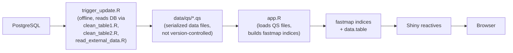

# Dashboard Technical Overview

Technical reference for the ICM Cerebral SVD Dashboard runtime architecture, features, data flow, and frontend stack. For the Python ETL pipeline, see [python-etl-pipeline.md](python-etl-pipeline.md). For Kubernetes deployment, see [kubernetes-cluster-overview.md](kubernetes-cluster-overview.md).

---

## Technology Stack

| Component | Technology | Role |
|-----------|-----------|------|
| Application framework | R Shiny | Reactive web application |
| UI framework | bslib (Bootstrap 5) | Theming, layout, light/dark mode |
| Data manipulation | data.table | Filtering with `get()` for dynamic columns |
| Fast lookups | fastmap | O(1) index maps for multi-value filters |
| Serialization | qs | 3-5x faster than RDS for data loading |
| Data tables | DT (DataTables) | Interactive sortable/searchable tables |
| Mapping | Leaflet | Interactive clinical trials map |
| Tooltips | Tippy.js (bundled) | Rich HTML tooltips on table cells |
| Timeline plot | Python (Plotly SVG) | Clinical trials timeline visualization |
| Font | Roboto (local TTF) | Consistent typography without CDN |

## Runtime Data Flow



The dashboard has **no database connection at runtime**. All data is read from pre-generated QS files produced by `scripts/trigger_update.R`.

### QS Data Files

| File | Contents |
|------|----------|
| `table1_clean.qs` | Gene table (putative causal genes for SVD) |
| `table2_clean.qs` | Clinical trials table (drugs, registries, phases) |
| `gene_info_results_df.qs` | NCBI Gene info for Table 1 genes (ID, protein, aliases) |
| `gene_info_table2.qs` | NCBI Gene info for Table 2 genes |
| `prot_info_clean.qs` | UniProt protein information |
| `refs.qs` | PubMed publication references for tooltips |
| `gwas_trait_names.qs` | GWAS trait abbreviation-to-full-name mapping |
| `geocoded_trials.qs` | Geocoded trial site locations for the map |

Additionally, `data/csv/omim_info.csv` provides OMIM disease annotations.

## Startup Sequence

The startup sequence in `app.R` proceeds as follows:

1. Load 21 required R packages with error handling (fails fast on missing packages)
2. Load local Roboto font from `www/fonts/Roboto-Regular.ttf` via sysfonts/showtext
3. Configure bslib Sass disk cache (`.bslib-cache/`, 30-day TTL, 50 MB max)
4. Auto-minify CSS and JS source files to `.min.*` variants
5. Source all R files in strict dependency order (see below)
6. `load_and_prepare_data()` -- reads QS files, builds fastmap indices for GWAS traits, omics types, OMIM, and protein info
7. `prepare_table1_display()` -- pre-computes all tooltip HTML for Table 1
8. Compute dashboard statistics (gene count, publication count)
9. Optionally preload Table 2 data (`PRELOAD_TABLE2` env var, default `TRUE`)
10. `build_ui()` / `build_server()` then `shinyApp()`

### Source File Loading Order

Files must be sourced in this exact order. Reordering causes undefined function errors:

```mermaid
flowchart LR
    A[constants.R] --> B[utils.R] --> C[filter_utils.R]
    C --> D[data_prep.R] --> E[tooltips.R] --> F[mod_checkbox_filter.R]
    F --> G[server_table1.R] --> H[server_table2.R] --> I[fetch_trial_locations.R]
    I --> J[server_map.R] --> K[ui.R] --> L[server.R]
```



## Application Structure

The app uses **functional composition, not Shiny modules** for its primary structure. `build_ui()` and `build_server()` are factory functions that return the UI definition and server function respectively.

The only true Shiny module (using `NS()`/`moduleServer()`) is `mod_checkbox_filter.R`, which implements reusable checkbox filter widgets with "Show All" toggle logic.

Server logic is split across four files:

| File | Responsibility |
|------|---------------|
| `server.R` | Orchestration: theme switching, filter initialization, wiring Table 1/2/map |
| `server_table1.R` | Gene table filtering, DataTable rendering, filter messages |
| `server_table2.R` | Clinical trials filtering, sample size histogram, lazy loading |
| `server_map.R` | Leaflet map rendering, marker clustering, lazy data loading |

## Tabs

| Tab | Content | Key Details |
|-----|---------|-------------|
| About | Summary statistics (value boxes), citation info, contact | Displays live counts of genes, drugs, trials, publications |
| Genes | Interactive gene table with sidebar filters | Table 1; 3 checkbox filters (MR, GWAS traits, omics); pre-computed tooltips |
| Phenogram | Embedded interactive phenogram (HTML widget) | Lazy-loaded iframe (`phenogram_template.html`), sandboxed |
| Clinical Trials | Interactive trials table with sidebar filters | Table 2; 5 checkbox filters + sample size slider; lazy-loaded unless preloaded |
| Trials Timeline | Embedded Plotly SVG timeline of trial drugs | Lazy-loaded iframe (`python_plot.html`), generated by `scripts/python_plot.py` |
| Trials Map | Leaflet map of clinical trial sites worldwide | NCT-registered trials only; marker clustering; lazy-loaded geocoded data |

Table 2, the map, the phenogram, and the timeline are all **lazy-loaded** -- data or iframes load only when the respective tab is first accessed.

## Filtering Infrastructure

### Generic Filter Functions (`filter_utils.R`)

All filtering uses `data.table` with `get()` for dynamic column access. Five filter functions cover all use cases:

- `apply_column_filter()` -- exact, prefix, or regex matching on a column
- `apply_index_filter()` -- O(1) lookup via pre-computed fastmap row indices
- `apply_range_filter()` -- numeric range filtering (sample size slider)
- `apply_sponsor_type_filter()` -- Academic/Industry logic with prefix matching
- `apply_single_value_filter()` -- binary filters (e.g., Mendelian Randomization)

All filter functions include `stopifnot()` assertions for type safety.

### fastmap Indices

Pre-computed at startup in `load_and_prepare_data()` and `load_table2_data()`:

- `gwas_trait_rows` -- maps each GWAS trait to row indices in Table 1
- `omics_type_rows` -- maps each omics type to row indices in Table 1
- `registry_rows` -- maps each registry pattern (NCT, ISRCTN, ACTRN, ChiCTR) to row indices in Table 2
- `prot_info_lookup` -- maps gene names to UniProt accession/URL
- `omim_lookup` -- maps OMIM numbers to phenotype/inheritance data

### List Column Handling

Table 1 has four list columns requiring `lapply`/`vapply` for processing: `GWAS Trait`, `Evidence From Other Omics Studies`, `References`, and `Link to Monogenic Disease`.

### Debouncing

- Sample size slider: 500 ms (`SLIDER_DEBOUNCE_MS`)
- Checkbox filters: 150 ms (`CHECKBOX_DEBOUNCE_MS`)
- DataTable search: 500 ms (`DATATABLE_SEARCH_DELAY`)

Filter message rendering and filtered data reactives use `bindCache()`.

## Frontend Stack

### Theming

- bslib Bootstrap 5 with `light_theme` / `dark_theme` definitions in `ui.R`
- Light/dark mode toggle via `bslib::input_dark_mode()`
- Light: primary `#2d287a`, secondary `#667eea`, bg `#ffffff`
- Dark: primary `#6366f1`, secondary `#818cf8`, bg `#121212`, glassmorphism gradient in CSS (`linear-gradient(135deg, #0f0c29, #302b63, #24243e)`)

### CSS and JavaScript

- Edit `www/custom.css` and `www/custom.js` only -- `.min.*` files are auto-generated at startup
- Tippy.js and Popper.js bundled locally in `www/css/` and `www/js/`
- Tippy tooltips initialized via `initializeTippy()` in DataTable `drawCallback`
- `www/python_plot.js` handles timeline iframe resizing; also auto-minified

### Leaflet Map

- Base map rendered immediately; markers added via `leafletProxy` when map tab is accessed
- Marker clustering with coordinate jittering to separate co-located trial sites
- NCT-registered trials only (other registries lack location API access)
- Geocoded data cached in `data/qs/geocoded_trials.qs`

### Fonts

Local Roboto font loaded from `www/fonts/Roboto-Regular.ttf` via sysfonts. No external CDN dependency.

## Performance Patterns

These are intentional optimization decisions. Do not remove or refactor away:

1. **QS serialization** over RDS (3-5x faster load times). `safe_read_data()` handles QS-to-RDS fallback.
2. **fastmap indices** for O(1) multi-value lookups (GWAS traits, omics types, OMIM, protein info, registries).
3. **Pre-computed tooltip HTML** at startup via `prepare_table1_display()` / `prepare_table2_display()` -- no per-request HTML generation.
4. **Debounced inputs** -- slider (500 ms), checkboxes (150 ms), search (500 ms).
5. **`bindCache()`** on filtered data reactives and filter messages.
6. **`renderCachedPlot()`** with `sizeGrowthRatio()` for the sample size histogram.
7. **Lazy loading** -- Table 2, map data, phenogram iframe, and timeline iframe load only on first tab access.
8. **Marker clustering** with coordinate jittering on the Leaflet map.
9. **Local fonts** from `www/fonts/` (no Google Fonts CDN round-trip).

## Configuration

| Variable | Default | Purpose |
|----------|---------|---------|
| `PRELOAD_TABLE2` | `TRUE` | Preload Table 2 at startup. Set `FALSE` for memory-constrained environments. |

All constants (debounce timings, histogram config, data paths, registry patterns, URLs) are centralized in `R/constants.R`.

Docker runs the dashboard only (no Python pipeline or database). It requires pre-generated QS files baked into the image.

## Testing

Tests live in `tests/test_all.R` (~120 testthat + shinytest2 tests). Coverage includes utility functions, filter logic, tooltip generation, data preparation, and the checkbox filter module.

```bash
Rscript -e 'testthat::test_file("tests/test_all.R")'
```

## Related Documentation

- [Python ETL Pipeline](python-etl-pipeline.md) -- PubMed search, LLM extraction, validation, database loading
- [Pipeline Security](pipeline-security.md) -- credential management, API key handling
- [Kubernetes Cluster Overview](kubernetes-cluster-overview.md) -- deployment architecture, Helm charts