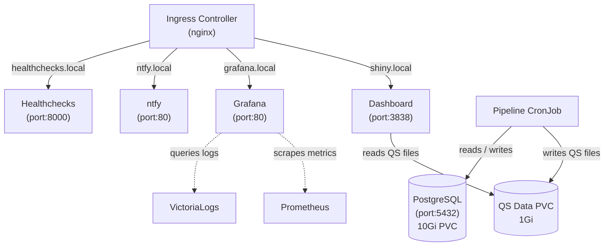
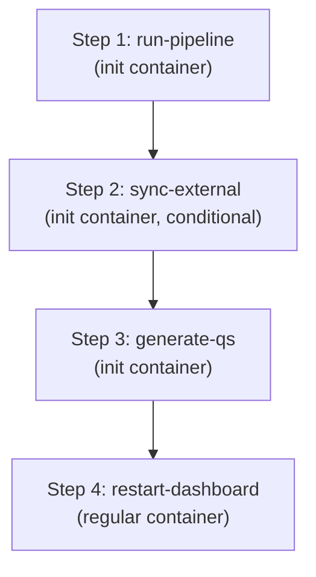
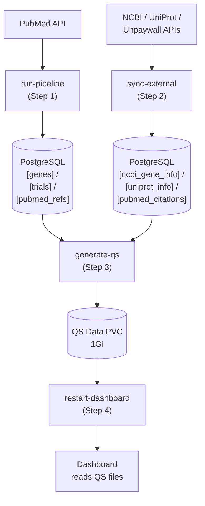

# Kubernetes Cluster Architecture

This document explains how the cSVD Dashboard platform runs on Kubernetes. It covers every
component in the Helm chart, how they connect, and how data moves through the system.

If you are new to Kubernetes, think of the cluster as a building where each component is a
tenant with its own room, address, and set of keys. The Helm chart is the blueprint that
describes every room, every lock, and every hallway.

---

## Table of Contents

- [Overview](#overview)
- [Architecture Diagram](#architecture-diagram)
- [Components](#components)
  - [Dashboard (Deployment)](#dashboard-deployment)
  - [PostgreSQL (StatefulSet)](#postgresql-statefulset)
  - [Pipeline (CronJob)](#pipeline-cronjob)
  - [ntfy (Deployment, optional)](#ntfy-deployment)
  - [Healthchecks (Deployment, optional)](#healthchecks-deployment)
  - [Observability Stack](#observability-stack)
- [How Data Flows](#how-data-flows)
- [Shared Storage](#shared-storage)
- [Networking](#networking)
- [Security](#security)
- [Configuration](#configuration)
- [Feature Flags](#feature-flags)
- [Glossary](#glossary)

---

## Overview

The Helm chart deploys a self-contained research platform with six concerns:

| Concern | What It Does | Kubernetes Resource |
|---------|-------------|---------------------|
| **Dashboard** | Interactive R Shiny web app for exploring up-to-date cSVD research data | Deployment |
| **Database** | PostgreSQL instance that stores extracted gene records | StatefulSet |
| **Pipeline** | Weekly Python ETL job: PubMed search, LLM extraction, data loading | CronJob |
| **Notifications** | Push alerts (ntfy) and uptime monitoring (Healthchecks) | Deployments |
| **Observability** | Metrics (Prometheus + Grafana) and logs (VictoriaLogs + Vector) | Subcharts |
| **Networking** | Ingress routing, internal services, optional network policies | Ingress, Services |

Everything is driven by a single `values.yaml` file. Change a value, run `helm upgrade`,
and the cluster converges to the new state.

---

## Architecture Diagram



---

## Components

### Dashboard (Deployment)

**Analogy**: The dashboard is the storefront -- the only part that visitors see. It reads
from a shelf of pre-built data files (QS files) and never talks to the database directly.

**Template**: `templates/dashboard-deployment.yaml`

| Property | Value |
|----------|-------|
| Image | `rshiny-dashboard:1.0.0` |
| Port | 3838 |
| Runs as user | 997 (non-root) |
| Replicas | 1 (configurable) |
| CPU | 1000m request / 4000m limit |
| Memory | 2Gi request / 4Gi limit |

**Startup sequence**:

1. An init container (`fix-qs-permissions`, busybox) runs as root to `chown` the QS data
   directory to uid 997, so the dashboard process can read it.
2. The main container starts and loads QS files from `/srv/shiny-server/data/qs`.
3. Startup probe allows up to 10 minutes for the app to initialize (pre-computing tooltip
   HTML, building fastmap indices, optionally preloading Table 2).

**Environment**:

| Variable | Source | Purpose |
|----------|--------|---------|
| `PRELOAD_TABLE2` | values.yaml | Controls whether Table 2 loads at startup or lazily |

**Volumes**:

| Mount Path | Source | Access |
|------------|--------|--------|
| `/srv/shiny-server/data/qs` | QS Data PVC | Read/Write |
| `/srv/shiny-server/.Renviron` | `.Renviron` Secret (subPath) | Read-Only |

**Health checks**:

| Probe | Endpoint | Timing |
|-------|----------|--------|
| Startup | `GET /` on port 3838 | 60 attempts, 10s apart (up to 10 min) |
| Liveness | `GET /` on port 3838 | Every 30s |
| Readiness | `GET /` on port 3838 | Every 10s |

---

### PostgreSQL (StatefulSet)

**Analogy**: The database is the filing cabinet. The pipeline puts records in; the QS
generation script reads them out. The dashboard never opens this cabinet directly.

**Template**: `templates/postgresql-statefulset.yaml`

| Property | Value |
|----------|-------|
| Image | `postgres:18` |
| Port | 5432 |
| Runs as user | 999 (postgres) |
| Replicas | 1 (single-instance, no HA) |
| CPU | 100m request / 500m limit |
| Memory | 256Mi request / 512Mi limit |
| Storage | 10Gi PVC (auto-provisioned by StatefulSet) |

**Why a StatefulSet?** Unlike a Deployment, a StatefulSet gives the database a stable
network identity (`postgresql-0`) and a persistent volume that survives pod restarts. If the
pod is evicted and rescheduled, it reattaches to the same 10Gi disk.

**Automatic schema initialization**: On first startup, PostgreSQL runs SQL scripts mounted
from a ConfigMap (`postgresql-initdb-configmap`) into `/docker-entrypoint-initdb.d/`:

| Order | File | Contents |
|-------|------|----------|
| 1 | `01-setup.sql` | Core tables (genes, clinical_trials, pubmed_refs), indices, triggers |
| 2 | `02-external-tables.sql` | Cache tables (ncbi_gene_info, uniprot_info, pubmed_citations) |

These scripts are embedded in the ConfigMap at template render time from the chart's `sql/`
directory.

**Service**: A headless ClusterIP service (`clusterIP: None`) provides stable DNS:
`<release>-svd-dashboard-postgresql.svd.svc.cluster.local`

---

### Pipeline (CronJob)

**Analogy**: The pipeline is the night-shift worker. Once a week it arrives, does four tasks
in order, and leaves. Each task must finish before the next one starts.

**Template**: `templates/pipeline-cronjob.yaml`

| Property | Value |
|----------|-------|
| Schedule | `0 3 * * 1` (3 AM UTC every Monday) |
| Concurrency | Forbid (no overlapping runs) |
| Deadline | 7200s (2 hours max) |
| Backoff limit | 1 (no retries on failure) |
| History | 3 successful / 3 failed jobs retained |

The CronJob uses **init containers** for the first three steps (they run sequentially and
must all succeed) and a **regular container** for the final step:



#### Step 1 -- Run Pipeline

```
python pipeline/main.py --days-back 7
```

Searches PubMed for recent papers, retrieves full text, extracts gene data via Claude LLM,
validates against NCBI Gene, and loads results into PostgreSQL.

- Image: `svd-pipeline:1.0.0`
- Secrets: `db-credentials` (envFrom) + `pipeline-secrets` (envFrom)
- Resources: 200m/1000m CPU, 512Mi/2Gi memory

#### Step 2 -- Sync External Data (conditional)

```
python pipeline/main.py --sync-external-data
```

Only runs if `pipeline.syncExternalData` is `true` in values.yaml. Fetches supplementary
data from NCBI Gene, UniProt, and PubMed and caches it in database tables.

- Same image, secrets, and resources as Step 1

#### Step 3 -- Generate QS Files

```
Rscript scripts/trigger_update.R
```

Reads all tables from PostgreSQL and produces serialized QS files (a fast binary format for
R) on the shared PVC at `/app/data/qs`.

- Secrets: `db-credentials` (envFrom), plus `NCBI_API_KEY` and `ENTREZ_EMAIL` from
  `pipeline-secrets` (individual valueFrom refs)

#### Step 4 -- Restart Dashboard

```
kubectl rollout restart deployment/<release>-svd-dashboard-dashboard
```

Triggers a rolling restart of the dashboard Deployment so the new pods pick up the freshly
written QS files.

- Resources: 50m/100m CPU, 64Mi/128Mi memory (lightweight kubectl call)
- Requires RBAC: a dedicated ServiceAccount with `get` and `patch` on `deployments`

**RBAC resources** (in `templates/pipeline-rbac.yaml`):

| Resource | Name |
|----------|------|
| ServiceAccount | `<release>-svd-dashboard-pipeline` |
| Role | `<release>-svd-dashboard-pipeline` |
| RoleBinding | `<release>-svd-dashboard-pipeline` |

The Role grants only `get` and `patch` on `apps/deployments` -- the minimum needed to
trigger a rollout restart.

---

### ntfy (Deployment)

**Analogy**: ntfy is the megaphone. When the pipeline finishes (or fails), it sends a
push notification here so you know without checking manually.

**Template**: `templates/ntfy-deployment.yaml`
**Condition**: `notifications.ntfy.enabled` (default: `true`)

| Property | Value |
|----------|-------|
| Image | `binwiederhier/ntfy:v2.17.0` |
| Port | 80 |
| CPU | 50m request / 200m limit |
| Memory | 64Mi request / 128Mi limit |
| Storage | 1Gi PVC for message cache |

**Configuration** (set via environment variables):

| Variable | Value |
|----------|-------|
| `NTFY_BASE_URL` | `http(s)://<ingress.hosts.ntfy>` |
| `NTFY_CACHE_FILE` | `/var/cache/ntfy/cache.db` |
| `NTFY_AUTH_DEFAULT_ACCESS` | `deny-all` (configurable) |
| `NTFY_BEHIND_PROXY` | `true` |
| `NTFY_ENABLE_SIGNUP` | `false` |

---

### Healthchecks (Deployment)

**Analogy**: Healthchecks is the attendance sheet. The pipeline pings it on each run. If
a ping is missed, Healthchecks raises an alert -- meaning the pipeline did not run as
scheduled.

**Template**: `templates/healthchecks-deployment.yaml`
**Condition**: `notifications.healthchecks.enabled` (default: `true`)

| Property | Value |
|----------|-------|
| Image | `healthchecks/healthchecks:v4` |
| Port | 8000 |
| CPU | 50m request / 250m limit |
| Memory | 128Mi request / 256Mi limit |
| Storage | 1Gi PVC (SQLite database) |
| Requires | `notifications.healthchecks.secretKey` (Django SECRET_KEY) |

Healthchecks uses SQLite (not the cluster's PostgreSQL) for its own data, stored on a
dedicated PVC.

---

### Observability Stack

The observability layer is built from two Helm subcharts and one custom Deployment.

#### Prometheus + Grafana (kube-prometheus-stack ~82.x)

**Condition**: `observability.prometheus.enabled` (default: `true`)

Deploys Prometheus (metrics collection), Grafana (dashboards), and Alertmanager (alert
routing). The Prometheus Operator enables declarative monitoring via ServiceMonitor and
PrometheusRule custom resources.

Namespace-scoped discovery: Prometheus only scrapes ServiceMonitors and PodMonitors in the
release namespace (matched via `kubernetes.io/metadata.name` label). This prevents
accidental cross-namespace metric collection.

#### VictoriaLogs (victoria-logs-single ~0.x)

**Condition**: `observability.victoriaLogs.enabled` (default: `true`)

Deploys VictoriaLogs for log aggregation with Vector as the log collector. Collects
stdout/stderr from all pods in the namespace.

| Setting | Value |
|---------|-------|
| Retention | 30 days |
| Storage | 50Gi PVC |

#### Grafana Image Renderer

**Template**: `templates/grafana-image-renderer-deployment.yaml`
**Condition**: deployed when `observability.prometheus.enabled` is `true`

| Property | Value |
|----------|-------|
| Image | `grafana/grafana-image-renderer:5.5.1` |
| Port | 8081 |
| Runs as user | 472 |

Renders Grafana panels as PNG/PDF images for alert notifications and scheduled reports.

#### External Grafana (optional)

If Grafana lives in a different namespace (e.g., a shared `monitoring` namespace), set
`observability.grafana.external.enabled: true` and `observability.prometheus.enabled: false`.
This creates an `ExternalName` Service that proxies traffic to the remote Grafana instance,
allowing the Ingress to route to it without moving it into this namespace.

---

## How Data Flows

The full data lifecycle, from PubMed paper to user-visible table row:



Key points:

- The dashboard never queries PostgreSQL at runtime. It reads pre-built QS files.
- The QS Data PVC is the bridge between the pipeline (writes) and the dashboard (reads).
- The pipeline restarts the dashboard after writing new QS files so the fresh data is loaded.

---

## Shared Storage

The chart provisions five persistent volumes. All use `ReadWriteOnce` by default.

| PVC | Size | Owner | Purpose |
|-----|------|-------|---------|
| `<release>-qs-data` | 1Gi | Pipeline (write), Dashboard (read) | Serialized QS data files |
| `<release>-postgresql-data-0` | 10Gi | PostgreSQL | Database files |
| `<release>-ntfy-cache` | 1Gi | ntfy | Message cache |
| `<release>-healthchecks-data` | 1Gi | Healthchecks | SQLite database |
| VictoriaLogs (subchart) | 50Gi | VictoriaLogs | Log storage |

**Scaling note**: The QS Data PVC defaults to `ReadWriteOnce`, which means only pods on the
same node can mount it simultaneously. This works when the dashboard has one replica. To
run multiple dashboard replicas across nodes, change `qsData.storage.accessMode` to
`ReadWriteMany` and use a CSI driver that supports it (NFS, EFS, CephFS).

---

## Networking

### Internal Services

Every component gets a ClusterIP Service for in-cluster communication:

| Service | Port | Type | Notes |
|---------|------|------|-------|
| Dashboard | 3838 | ClusterIP | Standard |
| PostgreSQL | 5432 | ClusterIP (headless) | `clusterIP: None` for StatefulSet |
| ntfy | 80 | ClusterIP | Conditional |
| Healthchecks | 8000 | ClusterIP | Conditional |
| Grafana Image Renderer | 8081 | ClusterIP | Conditional |

### Ingress

**Template**: `templates/ingress.yaml`
**Condition**: `ingress.enabled` (default: `true`)

The Ingress resource maps external hostnames to internal services. It requires an
nginx-ingress-controller already running in the cluster.

| Hostname (default) | Backend Service | Port |
|---------------------|----------------|------|
| `shiny.local` | Dashboard | 3838 |
| `grafana.local` | Grafana | 80 |
| `ntfy.local` | ntfy | 80 |
| `healthchecks.local` | Healthchecks | 8000 |

Optional hostnames (ntfy, healthchecks, grafana) are only included when their
respective components are enabled.

**TLS**: Set `ingress.tls.enabled: true` and provide either a pre-existing secret name
(`ingress.tls.secretName`) or a cert-manager cluster issuer
(`ingress.tls.clusterIssuer`) for automatic certificate provisioning.

### Network Policies (optional)

**Template**: `templates/network-policies.yaml`
**Condition**: `networkPolicies.enabled` (default: `false`)

When enabled (requires a CNI that supports NetworkPolicy, such as Calico or Cilium), four
policies restrict pod-to-pod traffic:

| Target | Allowed Sources | Port |
|--------|----------------|------|
| PostgreSQL | Pipeline pods only | 5432 |
| Dashboard | Ingress controller namespace only | 3838 |
| ntfy | Ingress controller namespace + Pipeline pods | 80 |
| Healthchecks | Ingress controller namespace + Pipeline pods | 8000 |

Egress is unrestricted -- all pods can initiate outbound connections (needed for PubMed,
NCBI, Anthropic API calls).

---

## Security

### Non-root Containers

Most workloads run as non-root users with privilege escalation disabled:

| Component | UID | GID | Capabilities |
|-----------|-----|-----|-------------|
| Dashboard | 997 | 997 | Drop ALL |
| PostgreSQL | 999 | 999 | Drop ALL |
| Grafana Image Renderer | 472 | -- | Drop ALL |

The dashboard has an init container that runs as root (uid 0) solely to fix file ownership
on the QS data volume. This is a common Kubernetes pattern for shared PVCs where the writer
(pipeline) and reader (dashboard) run as different users.

### Scoped Secrets

Secrets are split by concern so that each component only sees the credentials it needs:

| Secret | Contents | Mounted By |
|--------|----------|------------|
| `db-credentials` | DB host, port, name, user, password | PostgreSQL, Pipeline, Dashboard |
| `pipeline-secrets` | Anthropic, NCBI, Unpaywall API keys; notification URLs | Pipeline only |
| `.Renviron` | DB credentials + NCBI vars (R env file format) | Dashboard only |
| `healthchecks-secrets` | Django SECRET_KEY | Healthchecks only |

The dashboard never sees the `ANTHROPIC_API_KEY`. The pipeline never sees the Healthchecks
`SECRET_KEY`. Each component operates on a need-to-know basis.

### RBAC

A dedicated ServiceAccount, Role, and RoleBinding are created for the pipeline CronJob. The
Role grants only two verbs (`get`, `patch`) on one resource type (`deployments`) -- the
minimum permission needed to trigger `kubectl rollout restart`.

No other component requires custom RBAC. The dashboard and notification services use the
default ServiceAccount.

### PodDisruptionBudgets

**Template**: `templates/pdb.yaml`

Two PDBs ensure availability during voluntary disruptions (node drains, cluster upgrades):

| Component | Policy |
|-----------|--------|
| Dashboard | `minAvailable: 1` |
| PostgreSQL | `minAvailable: 1` |

These prevent Kubernetes from evicting the last running pod of either component during
planned maintenance.

---

## Configuration

Everything is driven by `values.yaml`. Here are the most important knobs:

### Essentials (must be set)

```yaml
postgresql:
  credentials:
    username: "your-db-user"
    password: "your-db-password"

secrets:
  anthropicApiKey: "sk-ant-..."
  ncbiApiKey: "..."
  entrezEmail: "you@example.com"
  unpaywallEmail: "you@example.com"
```

### Pipeline Schedule

```yaml
pipeline:
  schedule: "0 3 * * 1"        # Cron expression (default: 3 AM Monday)
  daysBack: 7                  # How many days of PubMed to search
  syncExternalData: true       # Whether to sync NCBI/UniProt/PubMed caches
  activeDeadlineSeconds: 7200  # Max runtime before the job is killed
```

### Ingress Hostnames

```yaml
ingress:
  hosts:
    dashboard: shiny.example.com
    grafana: grafana.example.com
    ntfy: ntfy.example.com
    healthchecks: healthchecks.example.com
  tls:
    enabled: true
    clusterIssuer: letsencrypt-prod
```

### Resource Tuning

| Component | Default CPU (req/lim) | Default Memory (req/lim) |
|-----------|----------------------|-------------------------|
| Dashboard | 1000m / 4000m | 2Gi / 4Gi |
| PostgreSQL | 100m / 500m | 256Mi / 512Mi |
| Pipeline | 200m / 1000m | 512Mi / 2Gi |
| ntfy | 50m / 200m | 64Mi / 128Mi |
| Healthchecks | 50m / 250m | 128Mi / 256Mi |
| Image Renderer | 50m / 250m | 128Mi / 256Mi |

### Storage Sizing

```yaml
postgresql:
  storage:
    size: 10Gi
qsData:
  storage:
    size: 1Gi
    accessMode: ReadWriteOnce  # Change to ReadWriteMany for multi-replica dashboard
```

---

## Feature Flags

Components can be toggled on or off without removing template files:

| Flag | Default | What It Controls |
|------|---------|-----------------|
| `notifications.ntfy.enabled` | `true` | ntfy Deployment, Service, PVC, Ingress rule, NetworkPolicy |
| `notifications.healthchecks.enabled` | `true` | Healthchecks Deployment, Service, PVC, Secret, Ingress rule, NetworkPolicy |
| `observability.prometheus.enabled` | `true` | kube-prometheus-stack subchart, Grafana Image Renderer, Grafana Ingress rule |
| `observability.victoriaLogs.enabled` | `true` | victoria-logs-single subchart (VictoriaLogs + Vector) |
| `observability.grafana.external.enabled` | `false` | ExternalName Service for Grafana in another namespace |
| `networkPolicies.enabled` | `false` | All NetworkPolicy resources (requires CNI support) |
| `ingress.enabled` | `true` | Ingress resource |
| `ingress.tls.enabled` | `false` | TLS termination and cert-manager annotation |
| `pipeline.syncExternalData` | `true` | sync-external init container in CronJob |

---

## Glossary

| Term | Meaning |
|------|---------|
| **ClusterIP** | The default Service type. Gives a pod an internal IP address reachable only from inside the cluster -- like an office extension number that does not work from outside the building. |
| **CNI** | Container Network Interface. The plugin that handles networking between pods. Some CNIs (Calico, Cilium) support NetworkPolicy; simpler ones (Flannel) do not. |
| **ConfigMap** | A Kubernetes object that holds non-secret configuration data (files, environment variables). This chart uses one to ship SQL schema files into the PostgreSQL container. |
| **CronJob** | A Kubernetes resource that creates a Job on a repeating schedule, like a cron entry on a Linux server. The pipeline runs as a CronJob. |
| **CSI** | Container Storage Interface. A standard that lets Kubernetes use external storage systems (NFS, AWS EBS, Ceph) as persistent volumes. |
| **Deployment** | A Kubernetes resource that manages a set of identical pods. If a pod crashes, the Deployment replaces it. The dashboard, ntfy, and Healthchecks all run as Deployments. |
| **envFrom** | A pod spec field that loads every key in a Secret or ConfigMap as an environment variable at once, rather than mapping them one by one. |
| **ExternalName Service** | A Service that acts as a DNS alias for something outside the current namespace. Used here to point to a Grafana instance in a separate namespace. |
| **Headless Service** | A Service with `clusterIP: None`. Instead of a single virtual IP, it returns the individual pod IPs through DNS. Required for StatefulSets so each pod has a stable hostname. |
| **Helm** | A package manager for Kubernetes. A Helm chart is a bundle of templates and default values that produce the YAML manifests Kubernetes needs. `helm install` and `helm upgrade` apply them. |
| **Ingress** | A Kubernetes resource that maps external hostnames and paths to internal Services. It requires an Ingress controller (like nginx) to actually handle the traffic. Think of it as the front-desk directory in a building lobby. |
| **Init Container** | A container that runs to completion before the main container starts. If it fails, the pod restarts. The pipeline uses init containers to guarantee steps run in order. |
| **Job** | A Kubernetes resource that runs a container once (or a fixed number of times) and then stops. CronJobs create Jobs on a schedule. |
| **Namespace** | A virtual partition inside a Kubernetes cluster. Resources in one namespace are isolated from those in another by default. This chart assumes all resources live in the same namespace. |
| **NetworkPolicy** | A firewall rule for pods. It defines which pods can talk to which other pods on which ports. Requires a CNI that supports it. |
| **PersistentVolumeClaim (PVC)** | A request for storage. When a pod mounts a PVC, Kubernetes provisions a disk (or reuses an existing one) and attaches it. Data on a PVC survives pod restarts. |
| **Pod** | The smallest deployable unit in Kubernetes -- one or more containers that share networking and storage. Every workload ultimately runs inside a pod. |
| **PodDisruptionBudget (PDB)** | A policy that tells Kubernetes how many pods of a given type must stay running during voluntary disruptions like node drains. `minAvailable: 1` means "never evict the last one." |
| **QS** | A fast binary serialization format for R objects (from the `qs` package). About 3-5x faster than the standard RDS format. The pipeline writes QS files; the dashboard reads them. |
| **RBAC** | Role-Based Access Control. Kubernetes permissions system. A Role defines allowed actions; a RoleBinding grants that Role to a ServiceAccount or user. |
| **ReadWriteOnce (RWO)** | A PVC access mode where only pods on a single node can mount the volume. Fine for single-replica workloads. For multi-node access, use ReadWriteMany (RWX). |
| **Rollout Restart** | A `kubectl` command that triggers a zero-downtime restart of a Deployment by creating new pods before terminating old ones. The pipeline uses this to reload the dashboard after updating QS files. |
| **Secret** | Like a ConfigMap, but for sensitive data (passwords, API keys). Values are base64-encoded at rest and can be mounted as files or environment variables. |
| **ServiceAccount** | An identity for pods. When a pod needs to call the Kubernetes API (like restarting a Deployment), it authenticates using its ServiceAccount and the RBAC rules bound to it. |
| **ServiceMonitor** | A custom resource from the Prometheus Operator. It tells Prometheus which Services to scrape for metrics, on which port, and at what interval. |
| **StatefulSet** | Like a Deployment, but for workloads that need stable identities and persistent storage -- typically databases. Each pod gets a fixed name (`postgresql-0`) and its own PVC. |
| **Subchart** | A Helm chart listed as a dependency of another chart. This chart uses two subcharts: kube-prometheus-stack (Prometheus + Grafana) and victoria-logs-single (VictoriaLogs + Vector). |
| **TLS** | Transport Layer Security. Encrypts traffic between the user's browser and the Ingress controller. Certificates can be provided manually or auto-provisioned by cert-manager. |
| **values.yaml** | The configuration file for a Helm chart. Every setting (image tags, resource limits, feature flags, secrets) is defined here and injected into templates at render time. |
| **Vector** | A log collection agent (by Datadog). Deployed alongside VictoriaLogs to collect stdout/stderr from all pods and forward them for storage and querying. |
