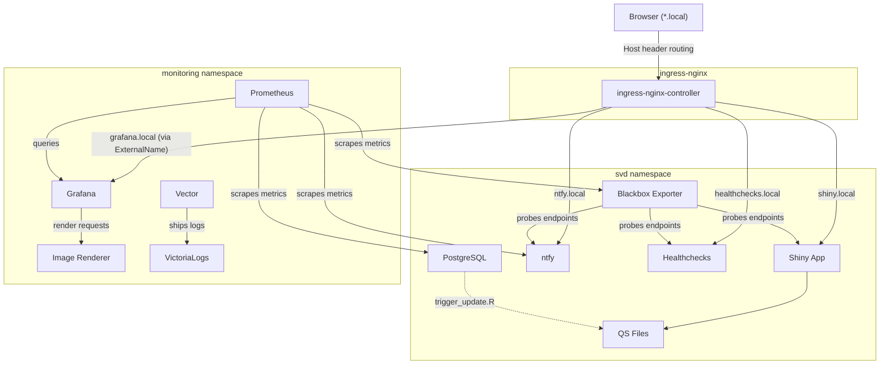

# Kubernetes Namespace Architecture

This document describes the namespaces in the SVD Dashboard Kubernetes cluster (Docker Desktop) and the pods within each.

## Cluster Overview

| Namespace | Purpose | Pods |
|-----------|---------|------|
| `kube-system` | Kubernetes control plane and core services | 9 |
| `ingress-nginx` | HTTP ingress controller | 1 |
| `monitoring` | Observability stack (Prometheus, Grafana, VictoriaLogs) | 9 |
| `svd` | Application stack (Shiny dashboard, PostgreSQL, notifications) | 5 |
| `default` | Unused (Kubernetes default) | 0 |
| `kube-node-lease` | Node heartbeat leases | 0 |
| `kube-public` | Unused (Kubernetes default) | 0 |

## `kube-system` — Kubernetes Core Infrastructure

The control plane and cluster services that make Kubernetes itself work. All managed by Docker Desktop.

| Pod | Purpose |
|-----|---------|
| `kube-apiserver-docker-desktop` | API server — all `kubectl` commands go through here |
| `etcd-docker-desktop` | Key-value store holding all cluster state |
| `kube-controller-manager-docker-desktop` | Runs controllers (Deployments, ReplicaSets, etc.) |
| `kube-scheduler-docker-desktop` | Assigns pods to nodes |
| `kube-proxy` | Network rules for Service routing |
| `coredns` (x2) | Cluster DNS — resolves service names (e.g. `prometheus-grafana.monitoring.svc.cluster.local`) |
| `storage-provisioner` | Docker Desktop's local PersistentVolume provisioner |
| `vpnkit-controller` | Docker Desktop networking bridge between macOS and the Linux VM |

## `ingress-nginx` — Ingress Controller

The single entry point for all external HTTP traffic into the cluster.

| Pod | Purpose |
|-----|---------|
| `ingress-nginx-controller` | Nginx reverse proxy routing `*.local` hostnames to backend services |

### Routing Rules

All routing is defined in the `svd-svd-dashboard` Ingress resource in the `svd` namespace:

| Hostname | Backend Service | Namespace | Port |
|----------|----------------|-----------|------|
| `shiny.local` | `svd-svd-dashboard-dashboard` | `svd` | 3838 |
| `grafana.local` | `svd-svd-dashboard-grafana-external` (ExternalName → `prometheus-grafana.monitoring`) | `svd` → `monitoring` | 80 |
| `ntfy.local` | `svd-svd-dashboard-ntfy` | `svd` | 80 |
| `healthchecks.local` | `svd-svd-dashboard-healthchecks` | `svd` | 8000 |

## `monitoring` — Observability Stack

Deployed via the `kube-prometheus-stack` Helm chart (release name: `prometheus`) and a separate `victoria-logs-single` Helm chart. Provides centralized metrics collection, alerting, dashboarding, and log aggregation.

### Metrics Pipeline

| Pod | Purpose |
|-----|---------|
| `prometheus-prometheus-kube-prometheus-prometheus-0` | Prometheus server — scrapes and stores time-series metrics |
| `prometheus-kube-prometheus-operator` | Manages Prometheus CRDs (`ServiceMonitor`, `PrometheusRule`, `Alertmanager`) |
| `prometheus-kube-state-metrics` | Exports Kubernetes object metrics (pod status, deployment replicas, etc.) |
| `prometheus-prometheus-node-exporter` | Exports host OS metrics (CPU, memory, disk, network) |
| `alertmanager-prometheus-kube-prometheus-alertmanager-0` | Routes and manages alerts from Prometheus |

### Dashboarding

| Pod | Purpose |
|-----|---------|
| `prometheus-grafana` | Grafana dashboard server (3 containers: grafana + 2 sidecars for dashboard/datasource provisioning) |
| `grafana-image-renderer` | Go-based Chromium renderer for Grafana image/PDF export |

### Log Aggregation

| Pod | Purpose |
|-----|---------|
| `victoria-logs-victoria-logs-single-server-0` | VictoriaLogs — log storage backend |
| `victoria-logs-vector` | Vector log collector — ships container and node logs to VictoriaLogs |

## `svd` — Application Stack

Deployed via the `svd-dashboard` Helm chart (release name: `svd`). Contains the R Shiny dashboard and all supporting services.

### Core Application

| Pod | Purpose |
|-----|---------|
| `svd-svd-dashboard-dashboard` | The R Shiny dashboard — serves the web UI at `shiny.local`, reads QS data files at runtime |
| `svd-svd-dashboard-postgresql-0` | PostgreSQL 18 database storing extracted gene data (StatefulSet with persistent storage) |

### Notification Services

| Pod | Purpose |
|-----|---------|
| `svd-svd-dashboard-ntfy` | ntfy push notification server — receives pipeline alerts |
| `svd-svd-dashboard-healthchecks` | Healthchecks cron monitoring — tracks pipeline CronJob execution |

### Monitoring Support

| Pod | Purpose |
|-----|---------|
| `svd-svd-dashboard-blackbox-exporter` | Probes HTTP endpoints (`shiny.local`, `ntfy.local`, `healthchecks.local`) and exposes availability metrics to Prometheus |

### Cross-Namespace Services

The `svd` namespace contains an **ExternalName** service (`svd-svd-dashboard-grafana-external`) that aliases `prometheus-grafana.monitoring.svc.cluster.local`. This allows the `grafana.local` ingress rule to route traffic to the Grafana pod in the `monitoring` namespace without duplicating the Grafana deployment.

## Data Flow Between Namespaces

