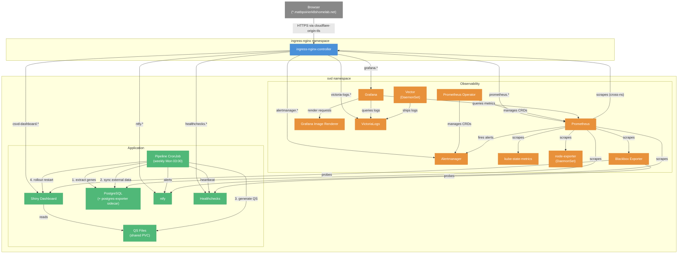

# Kubernetes Namespace Architecture

This document describes the namespaces on the SVD Dashboard k3s homelab cluster (`k3s-host`) and the pods that run in each. It is a live-cluster reference — regenerate it against `kubectl get pods -A` and the Helm chart in `helm/svd-dashboard/` whenever the deployment topology changes.

## Cluster Overview

| Namespace | Purpose | Pods |
| --- | --- | --- |
| `kube-system` | k3s control-plane helpers (kubelet extras; the apiserver/controller/scheduler/etcd/kube-proxy all run as a single systemd binary on the host, not as pods) | 4 |
| `ingress-nginx` | HTTP/HTTPS ingress controller | 1 |
| `svd` | Umbrella chart: Shiny dashboard, PostgreSQL, notifications, **plus** the `kube-prometheus-stack` and `victoria-logs-single` subcharts | 13 pods + 1 weekly CronJob |
| `monitoring` | Leftover namespace from an earlier two-release layout; currently **empty** | 0 |
| `default` | Unused (Kubernetes default) | 0 |
| `kube-node-lease` | Node heartbeat leases | 0 |
| `kube-public` | Unused (Kubernetes default) | 0 |

## `kube-system` — k3s Core Infrastructure

k3s bundles the control plane (`kube-apiserver`, `kube-controller-manager`, `kube-scheduler`, `etcd`/sqlite, `kube-proxy`) into a single systemd-managed binary on the host, so those components do **not** appear as pods. Only the following cluster-support workloads run as pods:

| Pod | Purpose |
| --- | --- |
| `coredns` | Cluster DNS — resolves service names (e.g. `svd-svd-dashboard-postgresql.svd.svc.cluster.local`) |
| `local-path-provisioner` | Rancher local-path CSI — k3s's default dynamic PersistentVolume provisioner (backs every PVC in the cluster) |
| `metrics-server` | Kubernetes Metrics Server — enables `kubectl top` and HPA autoscaling |
| `svclb-ingress-nginx-controller` | k3s `klipper-lb` service load balancer — gives the `ingress-nginx-controller` Service a reachable LoadBalancer IP on the host network (runs as a DaemonSet; one pod per node) |

## `ingress-nginx` — Ingress Controller

Single entry point for all external HTTPS traffic into the cluster.

| Pod | Purpose |
| --- | --- |
| `ingress-nginx-controller` | Nginx reverse proxy routing `*.matbpoirierk8shomelab.net` hostnames to backend services |

### Routing rules

All routing is defined in the `svd-svd-dashboard` Ingress resource in the `svd` namespace (`helm/svd-dashboard/templates/ingress.yaml`). TLS is terminated using the `cloudflare-origin-tls` Secret; every host is HTTPS-only.

| Hostname | Backend Service (namespace `svd`) | Port |
| --- | --- | --- |
| `csvd-dashboard.matbpoirierk8shomelab.net` | `svd-svd-dashboard-dashboard` | 3838 |
| `ntfy.matbpoirierk8shomelab.net` | `svd-svd-dashboard-ntfy` | 80 |
| `healthchecks.matbpoirierk8shomelab.net` | `svd-svd-dashboard-healthchecks` | 8000 |
| `grafana.matbpoirierk8shomelab.net` | `svd-grafana` | 80 |
| `prometheus.matbpoirierk8shomelab.net` | `svd-kube-prometheus-stack-prometheus` | 9090 |
| `alertmanager.matbpoirierk8shomelab.net` | `svd-kube-prometheus-stack-alertmanager` | 9093 |
| `victoria-logs.matbpoirierk8shomelab.net` | `svd-victoria-logs-single-server` | 9428 |

The `svd-dashboard` chart also creates one cross-namespace resource in `ingress-nginx` itself — a headless `svd-svd-dashboard-ingress-nginx-metrics` Service plus a matching `ServiceMonitor` (see `helm/svd-dashboard/templates/ingress-nginx-metrics-service.yaml` and `ingress-nginx-servicemonitor.yaml`). Together they let Prometheus scrape the controller's `/metrics` endpoint (port 10254).

## `monitoring` — Leftover (empty)

This namespace exists from an older deployment layout in which `kube-prometheus-stack` ran here as its own release and was bridged into `svd` through an `ExternalName` Service. It is currently **empty** — every observability component now runs inside `svd` via the umbrella chart's subchart dependencies.

It can be safely deleted (`kubectl delete ns monitoring`) or kept as a sentinel so that the optional external-Grafana mode (`observability.prometheus.enabled=false` plus `observability.grafana.external.enabled=true`) still has a target namespace available without another `kubectl create ns`.

## `svd` — Application + Observability Stack

Deployed via the `svd-dashboard` umbrella Helm chart (release name `svd`, fullname prefix `svd-svd-dashboard`). The chart bundles application pods alongside two subcharts — `kube-prometheus-stack` and `victoria-logs-single` — so every workload in the stack lives in this single namespace.

### Core application

| Pod | Purpose |
| --- | --- |
| `svd-svd-dashboard-dashboard` | R Shiny dashboard — serves the web UI at `csvd-dashboard.matbpoirierk8shomelab.net`, reads QS data files at runtime. Uses a `fix-qs-permissions` init container (busybox `chown`) so the non-root Shiny user (uid 997) can write to the shared QS PVC. |
| `svd-svd-dashboard-postgresql-0` | PostgreSQL 18 (StatefulSet). Two containers: `postgresql` plus a `postgres-exporter` sidecar that exposes Prometheus metrics on port 9187. |

### Notifications

| Pod | Purpose |
| --- | --- |
| `svd-svd-dashboard-ntfy` | ntfy push-notification server — receives pipeline alerts and forwards them upstream to ntfy.sh |
| `svd-svd-dashboard-healthchecks` | Healthchecks cron monitoring — tracks the pipeline CronJob's dead-man's-switch heartbeat |

### Chart-owned monitoring support

| Pod | Purpose |
| --- | --- |
| `svd-svd-dashboard-blackbox-exporter` | Probes HTTP endpoints (dashboard + healthchecks services) via the `svd-svd-dashboard-healthchecks-http` Probe CRD and exposes availability metrics to Prometheus |
| `svd-svd-dashboard-grafana-image-renderer` | Grafana-compatible Chromium renderer for PNG/PDF dashboard exports (port 8081); used by the `GF_RENDERING_SERVER_URL` in the Grafana subchart |

### Observability subchart — `kube-prometheus-stack`

Enabled by `observability.prometheus.enabled=true` (`helm/svd-dashboard/values.yaml:153-154`).

| Pod | Purpose |
| --- | --- |
| `prometheus-svd-kube-prometheus-stack-prometheus-0` | Prometheus server — scrapes and stores time-series metrics (containers: `prometheus` + `config-reloader` sidecar; plus `init-config-reloader` init container) |
| `alertmanager-svd-kube-prometheus-stack-alertmanager-0` | Alertmanager — routes and deduplicates alerts from Prometheus (containers: `alertmanager` + `config-reloader` sidecar; plus `init-config-reloader` init container) |
| `svd-kube-prometheus-stack-operator` | Prometheus Operator — reconciles `ServiceMonitor`, `PrometheusRule`, `Alertmanager`, `Probe`, and `Prometheus` CRDs |
| `svd-kube-state-metrics` | Exports Kubernetes object metrics (pod status, deployment replicas, etc.) |
| `svd-prometheus-node-exporter` | Host-OS metrics exporter (CPU, memory, disk, network). Runs as a DaemonSet — one pod per node. |
| `svd-grafana` | Grafana dashboard server. Three containers: `grafana` plus two provisioning sidecars (dashboards + datasources). Pre-loads the VictoriaLogs datasource via the `svd-svd-dashboard-vlogs-datasource` ConfigMap. |

The Prometheus CRD selectors in `values.yaml` are scoped to `kubernetes.io/metadata.name: svd`, so only `ServiceMonitor`/`PodMonitor`/`Probe`/`PrometheusRule` resources in the `svd` namespace are picked up.

### Observability subchart — `victoria-logs-single`

Enabled by `observability.victoriaLogs.enabled=true` (`helm/svd-dashboard/values.yaml:155-159`).

| Pod | Purpose |
| --- | --- |
| `svd-victoria-logs-single-server-0` | VictoriaLogs — log-storage backend (retention 30 days, 10 Gi PVC) |
| `svd-vector` | Vector log collector — ships container and node logs to VictoriaLogs. Runs as a DaemonSet — one pod per node. |

### Pipeline CronJob

The `svd-svd-dashboard-pipeline` CronJob runs the weekly ETL pipeline: extracts gene data from PubMed, syncs external data, regenerates QS files, and restarts the dashboard.

| Property | Value |
| --- | --- |
| **Schedule** | `0 3 * * 1` (every Monday at 03:00 cluster-local time) |
| **ServiceAccount** | `svd-svd-dashboard-pipeline` (Role grants `get` / `patch` on Deployments) |
| **Active deadline** | `7200` seconds (2 h wall-clock maximum before the job is killed) |
| **Shared storage** | Mounts the `svd-svd-dashboard-qs-data` PVC (same volume as the dashboard) |
| **Concurrency** | `Forbid` (one run at a time) |

**Execution sequence** — three init containers run sequentially, then the main container:

| Step | Container | Command | Purpose |
| --- | --- | --- | --- |
| 1 | `run-pipeline` (init) | `python pipeline/main.py --days-back 7` | Search PubMed for new papers, extract genes via LLM, load into PostgreSQL |
| 2 | `sync-external` (init) | `python pipeline/main.py --sync-external-data` | Sync NCBI Gene, UniProt, and PubMed citation data. Gated on `pipeline.syncExternalData` (default `true` in `values.yaml`). |
| 3 | `generate-qs` (init) | `Rscript scripts/trigger_update.R` | Read PostgreSQL tables and regenerate QS data files on the shared PVC |
| 4 | `restart-dashboard` (main) | `kubectl rollout restart deployment/svd-svd-dashboard-dashboard` | Rolling restart of the Shiny dashboard to pick up the new QS files |

### Cross-namespace resources created by the `svd` chart

Even though every workload lives in `svd`, two templates intentionally place resources elsewhere:

1. **`ingress-nginx-metrics` Service + ServiceMonitor** — written into the `ingress-nginx` namespace so Prometheus can scrape the controller's metrics port (see `helm/svd-dashboard/templates/ingress-nginx-{metrics-service,servicemonitor}.yaml`).
2. **Optional `svd-svd-dashboard-grafana-external` ExternalName Service** — only rendered when `observability.prometheus.enabled=false` **and** `observability.grafana.external.enabled=true`. In that mode it aliases `{serviceName}.{namespace}.svc.cluster.local` (default `prometheus-grafana.monitoring`) so the `grafana.matbpoirierk8shomelab.net` ingress can still resolve. **Disabled in the current deployment** — see `helm/svd-dashboard/templates/grafana-external-service.yaml`.

### PodDisruptionBudgets

Two PDBs (`helm/svd-dashboard/templates/pdb.yaml`) protect availability during voluntary disruptions (node drains, upgrades):

| PDB | Target | Policy |
| --- | --- | --- |
| `svd-svd-dashboard-dashboard` | Dashboard Deployment | `minAvailable: 1` |
| `svd-svd-dashboard-postgresql` | PostgreSQL StatefulSet | `minAvailable: 1` |

## Data Flow

```mermaid
flowchart TD
    Browser["Browser\n(*.matbpoirierk8shomelab.net)"]

    subgraph ingress_nginx[ingress-nginx namespace]
        Ingress["ingress-nginx-controller"]
    end

    Browser -->|"HTTPS via cloudflare-origin-tls"| Ingress

    subgraph svd_ns[svd namespace]
        subgraph app[Application]
            Shiny["Shiny Dashboard"]
            QS["QS Files\n(shared PVC)"]
            PG["PostgreSQL\n(+ postgres-exporter sidecar)"]
            Ntfy["ntfy"]
            Healthchecks["Healthchecks"]
            Pipeline["Pipeline CronJob\n(weekly Mon 03:00)"]
        end

        subgraph obs[Observability]
            Prometheus["Prometheus"]
            Alertmanager["Alertmanager"]
            Operator["Prometheus Operator"]
            KSM["kube-state-metrics"]
            NodeExp["node-exporter\n(DaemonSet)"]
            Grafana["Grafana"]
            Renderer["Grafana Image Renderer"]
            Blackbox["Blackbox Exporter"]
            VictoriaLogs["VictoriaLogs"]
            Vector["Vector\n(DaemonSet)"]
        end
    end

    Ingress -->|"csvd-dashboard.*"| Shiny
    Ingress -->|"ntfy.*"| Ntfy
    Ingress -->|"healthchecks.*"| Healthchecks
    Ingress -->|"grafana.*"| Grafana
    Ingress -->|"prometheus.*"| Prometheus
    Ingress -->|"alertmanager.*"| Alertmanager
    Ingress -->|"victoria-logs.*"| VictoriaLogs

    Shiny -->|"reads"| QS
    Pipeline -->|"1. extract genes"| PG
    Pipeline -->|"2. sync external data"| PG
    Pipeline -->|"3. generate QS"| QS
    Pipeline -->|"4. rollout restart"| Shiny
    Pipeline -->|"alerts"| Ntfy
    Pipeline -->|"heartbeat"| Healthchecks

    Operator -->|"manages CRDs"| Prometheus
    Operator -->|"manages CRDs"| Alertmanager
    Prometheus -->|"fires alerts"| Alertmanager
    Grafana -->|"queries metrics"| Prometheus
    Grafana -->|"queries logs"| VictoriaLogs
    Grafana -->|"render requests"| Renderer

    Prometheus -->|"scrapes"| PG
    Prometheus -->|"scrapes"| Ntfy
    Prometheus -->|"scrapes"| KSM
    Prometheus -->|"scrapes"| NodeExp
    Prometheus -->|"scrapes"| Blackbox
    Prometheus -->|"scrapes (cross-ns)"| Ingress
    Blackbox -->|"probes"| Shiny
    Blackbox -->|"probes"| Healthchecks
    Vector -->|"ships logs"| VictoriaLogs

    classDef ingress fill:#4a90d9,stroke:#3a7bc8,color:#fff
    classDef appNode fill:#50b878,stroke:#40a868,color:#fff
    classDef obsNode fill:#e8913a,stroke:#d8812a,color:#fff
    classDef external fill:#888,stroke:#777,color:#fff

    class Browser external
    class Ingress ingress
    class Shiny,QS,PG,Ntfy,Healthchecks,Pipeline appNode
    class Prometheus,Alertmanager,Operator,KSM,NodeExp,Grafana,Renderer,Blackbox,VictoriaLogs,Vector obsNode
```

| Color | Role |
| --- | --- |
| Blue | `ingress-nginx-controller` — TLS termination and host-based routing |
| Green | Application workloads — Shiny, PostgreSQL, ntfy, Healthchecks, Pipeline CronJob, shared QS PVC |
| Orange | Observability — Prometheus stack, VictoriaLogs + Vector, Grafana + Image Renderer, Blackbox Exporter |
| Grey | External (browser) |
