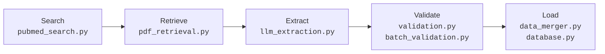
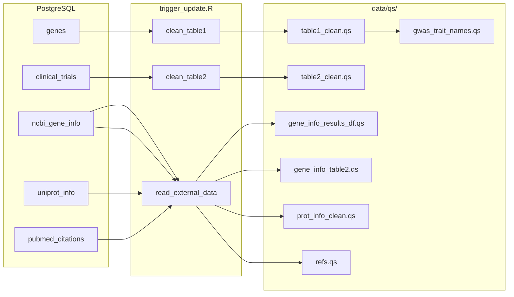

# ETL Pipeline

The Python ETL pipeline discovers new cerebral small vessel disease (cSVD) genetics research on PubMed, retrieves the full text of each paper, uses an LLM to extract structured gene data, validates every extraction against NCBI Gene, and loads the results into PostgreSQL. Think of it as an automated research assistant that reads papers, takes structured notes according to a strict schema, and files them in a database -- running on a weekly schedule so the dashboard always reflects the latest literature.

## High-Level Flow



Each stage is a distinct Python module. A paper flows through all five stages in sequence, but multiple papers are processed concurrently (bounded by a semaphore). If any single paper fails at any stage, it is logged and skipped without halting the batch.

## Execution Modes

The pipeline supports four mutually exclusive modes, selected via CLI flags in `pipeline/main.py`:

| Mode | Flag | Database? | Description | Example |
| ---- | ---- | --------- | ----------- | ------- |
| **Standard** | *(none)* | Yes | Search PubMed, retrieve, extract, validate, merge into DB | `python pipeline/main.py --days-back 30` |
| **Local PDF** | `--local-pdfs PATH` | No | Extract from local PDF files, write JSON report only | `python pipeline/main.py --local-pdfs papers/` |
| **PMID file** | `--pmids FILE` | No | Process specific PMIDs from a text file, write JSON report only | `python pipeline/main.py --pmids pmids.txt` |
| **External sync** | `--sync-external-data` | Yes | Refresh NCBI Gene, UniProt, and PubMed citation caches | `python pipeline/main.py --sync-external-data` |

Additional flags: `--dry-run` (skip database writes), `--test-mode` (skip LLM extraction), `--skip-validation` (skip NCBI validation, only with `--local-pdfs` or `--pmids`).

## Stage-by-Stage Walkthrough

### 1. Search (`pubmed_search.py`)

Queries PubMed via NCBI Entrez E-utilities for recent cSVD genetics papers.

**Query construction.** The query is built at module load time from three term lists combined with boolean logic:

- **Disease terms**: `"cerebral small vessel disease"`, `"small vessel disease"` (Title/Abstract)
- **Genetic terms**: `gene`, `genetic`, `GWAS`, `EWAS`, `TWAS`, `PWAS`, `genome-wide`, `variant`, `mutation`, `polymorphism` (Title/Abstract)
- **Marker terms**: `stroke`, `dementia`, `lacunes`, `white matter hyperintensities`, `perivascular spaces`, `cerebral microbleeds` (Title/Abstract)

The final query is: `(disease AND genetic) OR (marker AND disease)`.

**Date range.** `Entrez.esearch()` is called with `mindate` set to N days ago (default 7) and `retmax=500`. The `usehistory` parameter is enabled for server-side result caching.

**Deduplication.** After search, `filter_new_pmids()` removes PMIDs that already exist in the `pubmed_refs` table (fetched via `database.get_existing_pmids()`), preserving order and deduplicating within the batch.

### 2. Retrieve (`pdf_retrieval.py`)

Attempts to obtain the fullest possible text for each paper through a three-source cascade:

```text
PMC full text (XML) --> Unpaywall OA PDF --> PubMed abstract (XML)
```

1. **PubMed Central.** Converts the PMID to a PMCID via the NCBI ID Converter API, then fetches the full XML body from PMC via `efetch`. Extracts paragraph text from `<body>` or `<sec>` elements.

2. **Unpaywall.** If no PMC article exists and a DOI is available, queries the Unpaywall API for an open-access PDF URL. Downloads the PDF (with a 120-second read timeout, 100 MB size cap) and extracts text using PyMuPDF (fitz).

3. **Abstract fallback.** If neither full-text source succeeds, fetches the structured abstract from PubMed via `efetch` XML. Handles both single-section and multi-section (labeled) abstracts.

**PDF text cleaning.** `_extract_clean_pdf_text()` applies layout-aware heuristics:

- Filters header/footer blocks using Y-coordinate margins (top 40pt, bottom 740pt).
- Truncates at the earliest "back matter" section (References, Bibliography, Methods, Acknowledgements, etc.) found in the latter half of the document, preventing the LLM from hallucinating gene mentions from bibliography entries.

### 3. Extract (`llm_extraction.py`, `prompts.py`)

Sends the retrieved text to the Anthropic Claude API and parses the response into typed `GeneEntry` instances.

**API configuration.**

- Model: `claude-opus-4-6` (configurable via `PIPELINE_LLM_MODEL`)
- Max output tokens: 32,000
- Adaptive thinking: `{"type": "adaptive"}` -- the model dynamically allocates reasoning depth per request
- Structured output: `output_config` with `json_schema` format using `transform_schema(ExtractionResult)` for constrained decoding (guaranteed valid JSON)

**Prompt structure.** `build_extraction_messages()` returns system blocks and user messages designed for prompt caching:

- Two system blocks (system prompt + extraction instructions) with `cache_control: {"type": "ephemeral", "ttl": "1h"}`, so the ~4K-token instruction set is cached across calls within the same hour.
- User message wraps the paper text in `<document>` tags with the PMID and a short extraction query. Paper text is truncated to `max_paper_text_chars` (default 100,000) and XML-injection-safe escaped.

**Prompt content.** The system prompt establishes the LLM as a cSVD genetics systematic reviewer. The extraction instructions define:

- Inclusion criteria (what constitutes putative causal evidence)
- An 8-step extraction strategy (stroke-subtype specificity, pathway-only exclusion, monogenic gene filtering, multi-gene loci handling, negative results, MR-exposure distinction, animal model nomenclature mapping)
- Field guidance for the `GeneEntry` schema
- A 6-tier confidence scoring rubric (0.0 to 1.0) with cross-cutting modifiers

**Schema.** `ExtractionResult` wraps a list of `GeneEntry` (Pydantic models):

| Field | Type | Description |
| ----- | ---- | ----------- |
| `gene_symbol` | `str` | Official HGNC gene symbol |
| `protein_name` | `str \| None` | Protein name |
| `gwas_trait` | `list[str]` | Canonical cSVD trait abbreviations |
| `mendelian_randomization` | `bool` | Whether MR evidence exists |
| `omics_evidence` | `list[str]` | Omics/analytical study types |
| `confidence` | `float` | 0.0--1.0 per the scoring rubric |
| `causal_evidence_summary` | `str \| None` | 1--3 sentence explanation |
| `pmid` | `str` | Set after extraction by the caller |

**Streaming.** The API call uses `client.messages.stream()` (required for adaptive thinking on Opus when requests may exceed 10 minutes). The final message is obtained via `stream.get_final_message()`.

**Retry budgets.** Two independent retry counters:

- **Rate-limit retries** (429 errors): up to `max_rate_limit_retries` (default 6), with exponential backoff capped at 64 seconds, respecting `retry-after` headers. On 429, `rate_limiter.signal_rate_limit()` triggers a global backoff across all concurrent tasks.
- **Validation retries** (JSONDecodeError / ValidationError / ValueError): up to `max_retries` (default 1). With constrained decoding, JSON parse failures are rare; only Pydantic constraint violations (e.g., confidence out of range) trigger retries.

**Actual usage correction.** After each successful call, the rate limiter's pre-estimated token count is corrected with the actual `input_tokens + output_tokens` from the response, improving TPM tracking accuracy for subsequent calls.

### 4. Validate (`validation.py`, `batch_validation.py`)

Validation happens at two levels: per-gene (individual) and per-batch (aggregate).

#### Individual validation (`validation.py`)

Three stages, fail-fast on critical errors:

1. **Confidence threshold.** Rejects genes with `confidence < 0.7` (configurable via `PIPELINE_CONFIDENCE_THRESHOLD`). This filters out weak associations and likely hallucinations.

2. **NCBI Gene lookup.** Queries NCBI Entrez `esearch` + `esummary` to verify the gene symbol exists in the human genome. Results are cached in-memory (keyed by uppercase symbol) to avoid redundant API calls. If the official NCBI symbol differs from the extracted symbol (alias resolution), the entry is normalized. NCBI requests are throttled to 10 req/s with API key (3 req/s without) and bounded by a semaphore (`ncbi_rate_limit`, default 10 concurrent).

3. **GWAS trait check.** Warns (but does not reject) on unrecognized GWAS trait abbreviations not in the `VALID_GWAS_TRAITS` frozenset (23 canonical cSVD phenotypes defined in `config.py`).

#### Batch validation (`batch_validation.py`)

Runs after all papers in the batch are processed, currently warning-only (does not block the pipeline). Uses Pandera for schema validation plus manual aggregate checks:

| Check | Threshold | Purpose |
| ----- | --------- | ------- |
| Gene duplication across papers | > 3 unique papers per gene | Detects over-extraction |
| Mean confidence | > 0.95 | Detects poor LLM calibration |
| Null `protein_name` rate | > 30% | Detects prompt quality degradation |
| Per-paper gene count | > 20 genes from one paper | Detects extraction hallucination |
| Summary length | > 1,000 chars | Detects text-copying instead of summarizing |

### 5. Load (`data_merger.py`, `database.py`)

Merges validated genes into PostgreSQL and records processed PMIDs.

**Insert/update partitioning.** `merge_gene_entries()` fetches all existing gene symbols from the `genes` table, then partitions incoming entries:

- **New genes** (symbol not in database): inserted with all fields.
- **Existing genes** (symbol already present): updated -- `gwas_trait` and `omics_evidence` are overwritten; `references` is appended (with deduplication check via `LIKE`).

**Atomic transaction.** `merge_genes_transactional()` wraps all inserts and updates in a single `conn.transaction()` block. If any operation fails, the entire batch rolls back, preventing partial writes.

**PMID recording.** `record_processed_pmids_batch()` records each processed PMID in the `pubmed_refs` table with metadata (fulltext availability, source, gene count). This happens *after* the gene merge succeeds, ensuring PMIDs are only marked as processed when their genes are actually written. Uses `ON CONFLICT ... DO UPDATE` for idempotency.

**Sequence reset.** Before merging, `reset_sequence("genes")` resets the PostgreSQL auto-increment sequence to `MAX(id) + 1` to avoid primary key conflicts. Uses whitelist validation and `quote_ident()` for SQL injection prevention.

## External Data Sync

The `--sync-external-data` mode (`external_data_sync.py`) populates cache tables consumed by the R transformation step. It runs independently of the main extraction pipeline.

1. Collects all gene symbols from `genes` (Table 1) and `clinical_trials` (Table 2) tables.
2. Extracts all PMIDs from the `genes.references` column.
3. **NCBI Gene info** (`ncbi_gene_fetch.py`): fetches description, aliases, and NCBI UID for each gene. Upserts into `ncbi_gene_info`.
4. **UniProt info** (`uniprot_fetch.py`): fetches protein name, GO annotations (biological process, molecular function, cellular component), and UniProt URL. Upserts into `uniprot_info`. Only Table 1 genes are synced.
5. **PubMed citations** (`pubmed_citations.py`): fetches formatted bibliographic data (authors, title, journal, date, DOI). Upserts into `pubmed_citations`.

Each external API module maintains its own in-memory cache and HTTP client, cleaned up after sync completes. The entire operation has a 1-hour timeout.

## From Database to Dashboard

After the pipeline writes to PostgreSQL, `scripts/trigger_update.R` transforms the data into QS files that the Shiny app loads at startup.



The script runs 7 sequential steps:

1. Fetch and clean the genes table via `clean_table1()` (column renaming, list-column parsing, data type normalization).
2. Fetch and clean the clinical trials table via `clean_table2()`.
3. Read NCBI gene info for Table 1 genes from the `ncbi_gene_info` cache table.
4. Read NCBI gene info for Table 2 genes from the same cache table.
5. Read UniProt protein info from the `uniprot_info` cache table.
6. Read PubMed citation references from the `pubmed_citations` cache table.
7. Extract GWAS trait names mapping from the cleaned Table 1 data.

The Shiny app reads only from QS files at runtime -- it has no database connection.

## Concurrency and Rate Limiting

The pipeline processes multiple papers concurrently, but must stay within API rate limits for both the Anthropic LLM API and NCBI E-utilities. Think of it as a turnstile system: each turnstile controls how many people can pass per minute, preventing the crowd from overwhelming the entrance.

**Paper-level concurrency.** An `asyncio.Semaphore` with `max_concurrent_papers` (default 5) bounds how many papers are processed simultaneously. All papers are launched via `asyncio.TaskGroup`, but only N run at a time.

**LLM rate limiter** (`rate_limiter.py`). A token-bucket implementation (`AsyncRateLimiter`) tracking both:

- **RPM** (requests per minute): default 50. Tracks timestamps of recent requests in a deque, pruning entries older than 60 seconds.
- **TPM** (tokens per minute): default 100,000. Pre-estimates token usage per call (`estimated_tokens_per_call`, default 40,000) and corrects with actual usage after each response.

The `acquire()` method blocks until both RPM and TPM budgets allow a new request. When any call receives a 429, `signal_rate_limit()` sets a global backoff deadline so all concurrent tasks pause (preventing a thundering herd).

**NCBI throttling.** NCBI E-utilities enforce 10 requests/second with an API key (3/second without). The validation module enforces this with:

- A minimum inter-request interval (`_throttle()`: 0.1s with key, 0.34s without)
- A semaphore (`ncbi_rate_limit`, default 10) bounding concurrent NCBI requests
- Exponential backoff with `retry-after` header parsing on 429 responses

**UniProt throttling.** Bounded by `uniprot_rate_limit` (default 5 concurrent requests).

## Error Handling Philosophy

The pipeline is designed to maximize the number of successfully processed papers, even when individual papers or API calls fail.

**Paper-level isolation.** `process_paper_safe()` wraps each paper's processing in a try/except block. A failure in one paper (network timeout, PDF parsing error, LLM refusal) produces a `PaperResult` with an `error` field but does not halt the batch. The final report includes both successes and failures.

**Fail-fast validation.** Individual gene validation uses early returns: if a gene fails the confidence threshold (Stage 1), NCBI lookup is never attempted. This conserves API quota for genes that are more likely to be valid.

**Graceful degradation in text retrieval.** The three-source cascade in `pdf_retrieval.py` means that even if PMC and Unpaywall are unreachable, the pipeline falls back to the abstract. An abstract-only extraction produces fewer genes but is better than skipping the paper entirely.

**Transaction rollback on DB errors.** The gene merge uses a PostgreSQL transaction. If any insert or update fails, the entire batch rolls back. PMID recording happens after a successful merge, so a rollback does not leave orphaned PMID records.

**Resource cleanup.** The `finally` block in each pipeline mode closes all shared HTTP clients (`httpx.AsyncClient`), the database connection pool, and clears in-memory caches, regardless of whether the run succeeded or failed.

## Configuration Reference

All settings are fields on `PipelineConfig` (`pipeline/config.py`). Each can be overridden via environment variable with the `PIPELINE_` prefix.

### LLM

| Variable | Default | Description |
| -------- | ------- | ----------- |
| `PIPELINE_LLM_MODEL` | `claude-opus-4-6` | Anthropic model ID |
| `PIPELINE_LLM_MAX_TOKENS` | `32000` | Maximum output tokens per call |
| `PIPELINE_LLM_EFFORT` | `high` | Adaptive thinking effort level (`low`, `high`, `max`) |
| `PIPELINE_MAX_PAPER_TEXT_CHARS` | `100000` | Max chars of paper text sent to the LLM |

### Retries

| Variable | Default | Description |
| -------- | ------- | ----------- |
| `PIPELINE_MAX_RETRIES` | `1` | Validation retry budget (JSON/Pydantic errors) |
| `PIPELINE_RETRY_DELAY` | `2.0` | Base delay between validation retries (seconds) |
| `PIPELINE_MAX_RATE_LIMIT_RETRIES` | `6` | Rate-limit (429) retry budget |
| `PIPELINE_RATE_LIMIT_RETRY_DELAY` | `1.0` | Base delay for rate-limit backoff (seconds) |

### Concurrency

| Variable | Default | Description |
| -------- | ------- | ----------- |
| `PIPELINE_MAX_CONCURRENT_PAPERS` | `5` | Max papers processed simultaneously |
| `PIPELINE_ESTIMATED_TOKENS_PER_CALL` | `40000` | Pre-estimate for TPM tracking |
| `PIPELINE_RPM_LIMIT` | `50` | LLM requests per minute |
| `PIPELINE_TPM_LIMIT` | `100000` | LLM tokens per minute |

### Validation

| Variable | Default | Description |
| -------- | ------- | ----------- |
| `PIPELINE_CONFIDENCE_THRESHOLD` | `0.7` | Minimum confidence to pass validation |

### External APIs

| Variable | Default | Description |
| -------- | ------- | ----------- |
| `PIPELINE_NCBI_RATE_LIMIT` | `10` | Max concurrent NCBI requests |
| `PIPELINE_UNIPROT_RATE_LIMIT` | `5` | Max concurrent UniProt requests |

### Database

| Variable | Default | Description |
| -------- | ------- | ----------- |
| `PIPELINE_DB_POOL_MIN` | `2` | Minimum asyncpg pool connections |
| `PIPELINE_DB_POOL_MAX` | `10` | Maximum asyncpg pool connections |
| `PIPELINE_DB_COMMAND_TIMEOUT` | `60.0` | SQL command timeout (seconds) |

### Notifications

| Variable | Default | Description |
| -------- | ------- | ----------- |
| `PIPELINE_NOTIFY_URLS` | *(empty)* | Apprise notification URLs (comma-separated) |
| `PIPELINE_HEALTHCHECK_URL` | *(empty)* | Healthcheck ping URL (start/success/fail) |
| `PIPELINE_EVENT_DB_PATH` | `logs/events.db` | SQLite path for event log |

### Required Environment Variables (not `PIPELINE_` prefixed)

| Variable | Used By | Purpose |
| -------- | ------- | ------- |
| `DB_HOST`, `DB_PORT`, `DB_NAME`, `DB_USER`, `DB_PASSWORD` | Pipeline + R scripts | PostgreSQL connection |
| `ANTHROPIC_API_KEY` | Pipeline | Claude API authentication |
| `NCBI_API_KEY` | Pipeline | NCBI Entrez API (higher rate limits) |
| `ENTREZ_EMAIL` | Pipeline | Required by NCBI policy for Entrez API |
| `UNPAYWALL_EMAIL` | Pipeline | Unpaywall API authentication |
