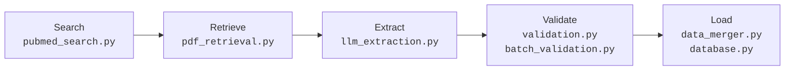
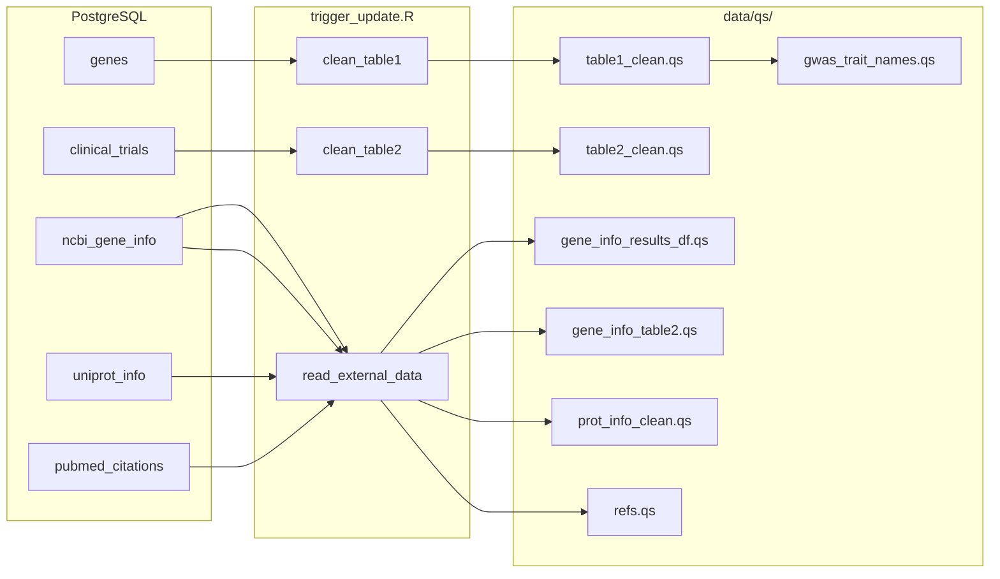

# ETL Pipeline

The Python ETL pipeline discovers new cerebral small vessel disease (cSVD) genetics research on PubMed, retrieves the full text of each paper, uses Claude to extract structured gene data, validates every extraction against NCBI Gene, and loads the results into PostgreSQL. Think of it as an automated research assistant that reads papers, takes structured notes according to a strict schema, and files them in a database -- running on a schedule so the dashboard always reflects the latest literature.

The rest of this document is organised by subsystem:

- **Overview** and **Execution Modes** — what the pipeline does and how to run it.
- **Extraction Pipeline** — the five-stage flow that turns a PMID into validated database rows.
- **External Data Sync** — a separate mode that refreshes NCBI / UniProt / PubMed cache tables.
- **Observability & Operations** — progress reporting, notifications, event log, healthcheck, and run reports.
- **Infrastructure** — rate limiter, concurrency, HTTP client, caching, connection pool, migrations.
- **Error Handling Philosophy** — how failures are isolated.
- **Configuration Reference** — every `PIPELINE_*` environment variable.
- **From Database to Dashboard** — how the R layer turns database rows into QS files for Shiny.

## High-Level Flow


```mermaid
flowchart LR
    A[Search<br><code>pubmed_search.py</code>] --> B[Retrieve<br><code>pdf_retrieval.py</code>]
    B --> C[Extract<br><code>llm_extraction.py</code>]
    C --> D[Validate<br><code>validation.py</code><br><code>batch_validation.py</code>]
    D --> E[Load<br><code>data_merger.py</code><br><code>database.py</code>]
```

Each stage is a distinct Python module. A paper flows through all five stages in sequence, but multiple papers are processed concurrently (bounded by a semaphore). If a single paper fails at any stage, it is logged and skipped; the batch continues.

## Execution Modes

The pipeline has combinable online selectors plus two mutually exclusive
offline modes, all selected via CLI flags in `pipeline/main.py`:

| Mode | Flag | Database? | Description | Example |
| ---- | ---- | --------- | ----------- | ------- |
| **PubMed extraction** | *(none)* or `--pubmed` | Yes | Search PubMed, retrieve, extract, validate, merge into DB | `python pipeline/main.py --pubmed --days-back 30` |
| **ClinicalTrials.gov** | `--clinical-trials` | Yes | Discover cSVD-relevant drug trials and refresh `clinical_trials` | `python pipeline/main.py --clinical-trials` |
| **External sync** | `--sync-external-data` | Yes | Refresh NCBI Gene, UniProt, and PubMed citation caches | `python pipeline/main.py --pubmed --sync-external-data` |
| **Local PDF** | `--local-pdfs PATH` | No | Extract from local PDF files, write JSON report only | `python pipeline/main.py --local-pdfs papers/` |
| **PMID file** | `--pmids FILE` | No | Process specific PMIDs from a text file, write JSON report only | `python pipeline/main.py --pmids pmids.txt` |

Additional flags:

- `--dry-run` — run through extraction and validation but skip the database merge; still emits a JSON report and notification.
- `--test-mode` — stop before LLM extraction (prints a preview of PMIDs that would be processed).
- `--skip-validation` — skip the NCBI gene lookup stage; only valid with `--local-pdfs` or `--pmids`. The local confidence-threshold check still runs.

`--pubmed`, `--clinical-trials`, and `--sync-external-data` can be combined and run in sequence with one healthcheck ping and notification. `--local-pdfs` and `--pmids` are offline modes; each is mutually exclusive with the other and with all online selectors. `main()` enforces this with explicit `parser.error()` checks.

## Extraction Pipeline

### 1. Search (`pubmed_search.py`)

Queries PubMed via NCBI Entrez E-utilities for recent cSVD genetics papers.

**Query construction.** The query is built at module load time from three term lists:

- **Disease terms**: `"cerebral small vessel disease"` (Title/Abstract).
- **Marker terms**: `stroke`, `dementia`, `lacunes`, `white matter hyperintensities`, `perivascular spaces`, `cerebral microbleeds` (Title/Abstract).
- **Genetic terms**: `gene`, `genetic`, `GWAS`, `EWAS`, `TWAS`, `PWAS`, `genome-wide`, `variant`, `mutation`, `polymorphism` (Title/Abstract).

The final query is: `(disease AND genetic) OR (marker AND disease)`.

**Date range and paging.** `Entrez.esearch` is called with `mindate` set to N days ago (default 7), `retmax=500` per page, and `usehistory="y"`. When more than 500 papers match, the module paginates using `WebEnv`/`QueryKey` up to `MAX_TOTAL_RESULTS=5000`; pagination errors log a warning and return the partial list rather than raising. Synchronous `BioPython` calls are wrapped with `asyncio.to_thread` so they don't block the event loop.

**Deduplication.** After search, `filter_new_pmids()` removes PMIDs already present in the `pubmed_refs` table (fetched via `database.get_existing_pmids()`), preserving order and deduplicating within the batch.

### 2. Retrieve (`pdf_retrieval.py`)

Attempts to obtain the fullest possible text for each paper through a three-source cascade:

```text
PMC full text (XML) --> Unpaywall OA PDF --> PubMed abstract (XML)
```

1. **PubMed Central.** Converts the PMID to a PMCID via the NCBI ID Converter API, then fetches the full XML body from PMC via `efetch`. Extracts paragraph text from `<body>` or `<sec>` elements.
2. **Unpaywall.** If no PMC article exists and a DOI is available, queries the Unpaywall API for an open-access PDF URL. Downloads the PDF with a 120-second read timeout and a 100 MB size cap (`MAX_PDF_BYTES`), then extracts text using PyMuPDF (fitz).
3. **Abstract fallback.** If neither full-text source succeeds, fetches the structured abstract from PubMed via `efetch` XML. Handles both single-section and multi-section (labeled) abstracts.

All XML parsing uses `SAFE_XML_PARSER` from `config.py`, which disables entity resolution and network access to prevent XXE attacks on untrusted NCBI responses.

**PDF text cleaning.** `_extract_clean_pdf_text()` applies layout-aware heuristics:

- Filters header/footer blocks using Y-coordinate margins (top 40pt, bottom 740pt).
- Truncates at the earliest "back matter" section (References, Bibliography, Methods, Acknowledgements, etc.) found in the latter half of the document, preventing the LLM from hallucinating gene mentions from bibliography entries.

### 3. Extract (`llm_extraction.py`, `prompts.py`)

Sends the retrieved text to the Anthropic Claude API and parses the streamed response into typed `GeneEntry` instances.

**API configuration.**

- Model: `claude-opus-4-7` (overridable via `PIPELINE_LLM_MODEL`).
- Max output tokens: auto-resolved from `MODEL_MAX_OUTPUT_TOKENS` when `PIPELINE_LLM_MAX_TOKENS=0` (the default). Opus 4.7 resolves to 128,000; Sonnet 4.6 and Haiku 4.5 to 64,000. Set the env var to any positive integer to override.
- Thinking: adaptive (`{"type": "adaptive", "display": "summarized"}`) for models in `ADAPTIVE_THINKING_MODELS` (`claude-opus-4-7`, `claude-sonnet-4-6`). Older models fall back to manual thinking (`{"type": "enabled", "budget_tokens": max_tokens - 8000}`, clamped to at least `max_tokens // 2`). `THINKING_OUTPUT_RESERVE=8000` reserves that many tokens for the JSON response text.
- Effort: `config.llm_effort` (default `"high"`). Only transmitted to the API when the value differs from `"high"` (the API default) and the model is in `EFFORT_CAPABLE_MODELS`.
- Structured output: `output_config` with `json_schema` format built via `transform_schema(ExtractionResult)` for constrained decoding (guaranteed schema-valid JSON).
- Streaming: `client.messages.stream()` with `get_final_message()`. Streaming is required because adaptive-thinking requests on Opus can exceed the 10-minute non-streaming timeout.

**Prompt construction.** `build_extraction_messages()` (in `prompts.py`) returns system blocks and user messages designed for prompt caching:

- Two system blocks (system prompt + extraction instructions) with `cache_control: {"type": "ephemeral", "ttl": "1h"}`, so the large instruction set is cached across calls within the same hour.
- User message wraps the paper text in `<document>` tags with the PMID and a short extraction query. Paper text is truncated to `max_paper_text_chars` (default 100,000) and XML-injection-safe escaped.
- `config.prompt_version` (default `"v5"`, overridable via `PIPELINE_PROMPT_VERSION`) selects between versioned prompts (`v1`–`v5`) kept in `prompts.py` for A/B testing during tuning.

**Prompt content (v5).** The system prompt establishes the LLM as a cSVD genetics systematic reviewer. The extraction instructions define:

- Inclusion criteria (what constitutes putative causal evidence).
- An 8-step extraction strategy (stroke-subtype specificity, pathway-only exclusion, monogenic gene filtering, multi-gene loci handling, negative results, MR-exposure distinction, animal model nomenclature mapping).
- Field guidance for the `GeneEntry` schema.
- A 6-tier confidence scoring rubric (0.0 to 1.0) with cross-cutting modifiers.

**Schema.** `ExtractionResult` wraps a list of `GeneEntry` (Pydantic models):

| Field | Type | Description |
| ----- | ---- | ----------- |
| `gene_symbol` | `str` | Official HGNC gene symbol |
| `protein_name` | `str \| None` | Protein name |
| `gwas_trait` | `list[str]` | Canonical cSVD trait abbreviations |
| `mendelian_randomization` | `bool` | Whether MR evidence exists |
| `omics_evidence` | `list[str]` | Omics/analytical study types |
| `confidence` | `float` | 0.0–1.0 per the scoring rubric (Pydantic-enforced) |
| `causal_evidence_summary` | `str \| None` | 1–3 sentence explanation |
| `pmid` | `str` | Set after extraction by the caller (default `""`) |

**Retry budgets.** Three independent retry counters (all defaults configurable):

- **Rate-limit retries** (`anthropic.RateLimitError` / 429): up to `max_rate_limit_retries` (default 6), exponential backoff `rate_limit_retry_delay * 2^(attempt-1)` capped at 64 seconds, respecting any `retry-after` header. When any call hits a 429, `rate_limiter.signal_rate_limit()` triggers a global backoff so sibling concurrent tasks also pause.
- **Connection retries** (`anthropic.APIConnectionError`, `httpx.RemoteProtocolError`, `httpx.ReadError`, `httpx.ConnectError`): up to `max_connection_retries` (default 3), exponential backoff `connection_retry_delay * 2^(attempt-1)` capped at 64 seconds.
- **Validation retries** (`json.JSONDecodeError` / `pydantic.ValidationError` / `ValueError`): up to `max_retries` (default 1). Constrained decoding makes JSON parse failures rare; the main trigger is Pydantic constraint violations (e.g., confidence out of range) or truncation detected via `stop_reason == "max_tokens"`.

On any other `anthropic.APIError` or unexpected exception, the extractor logs and returns an empty gene list — the paper is skipped but the batch continues.

**Usage accounting.** After each successful call the rate limiter's pre-estimated token count is corrected via `record_actual_usage(request_id, actual_tokens)`. The response's thinking tokens are estimated from the character ratio between thinking and text content blocks (the API reports a single `output_tokens` field that lumps both). All counts accumulate into the shared `TokenUsage` dataclass used by the report and cost estimator.

### 4. Validate (`validation.py`, `batch_validation.py`)

Validation happens at two levels: per-gene (individual) and per-batch (aggregate).

#### Individual validation (`validation.py`)

Three stages, fail-fast on critical errors:

1. **Confidence threshold.** Rejects genes with `confidence < 0.65` (configurable via `PIPELINE_CONFIDENCE_THRESHOLD`). Filters out weak associations and likely hallucinations.
2. **NCBI Gene lookup.** Queries NCBI Entrez `esearch` + `esummary` to verify the gene symbol exists in the human genome. Results are cached in a shared `OrderedDict`-backed LRU keyed by uppercase symbol (evicted by `evict_lru()` once past `DEFAULT_MAX_SIZE=10,000` entries, dropping the oldest `DEFAULT_EVICT_FRACTION=20%`). If the official NCBI symbol differs from the extracted one (alias resolution), the entry is normalized and a warning is attached. NCBI requests are throttled to 10 req/s with an API key (3 req/s without) and bounded by a semaphore (`ncbi_rate_limit`, default 10 concurrent).
3. **GWAS trait check.** Warns (but does not reject) on unrecognized GWAS trait abbreviations not in the `VALID_GWAS_TRAITS` frozenset (23 canonical cSVD phenotypes defined in `config.py`).

The `ValidationResult` dataclass returned to the caller carries `is_valid`, `errors`, `warnings`, and the possibly-normalized `GeneEntry`.

Stage-0 required-field checks from earlier versions are no longer needed — Pydantic enforces those at extraction time.

#### Batch validation (`batch_validation.py`)

Runs after all papers in the batch are processed, currently warning-only (does not block the pipeline). Uses Pandera for schema validation plus aggregate checks:

| Check | Threshold | Purpose |
| ----- | --------- | ------- |
| Gene duplication across papers | > 3 unique papers per gene | Detects over-extraction |
| Mean confidence | > 0.95 | Detects poor LLM calibration |
| Null `protein_name` rate | > 30% | Detects prompt quality degradation |
| Per-paper gene count | > 20 genes from one paper | Detects extraction hallucination |
| Summary length | > 1,000 chars | Detects text-copying instead of summarizing |

Warnings accumulate into the run report and the notification digest.

### 5. Load (`data_merger.py`, `database.py`)

Merges validated genes into PostgreSQL and records processed PMIDs.

**In-batch collapse.** `merge_gene_entries()` first groups entries by uppercase gene symbol and collapses duplicates via `_build_combined_gene_data()`: `gwas_trait`, `omics_evidence`, and PMID references are deduped and merged; `mendelian_randomization` is OR-reduced; the first non-null `protein_name` wins. This avoids the UPDATE step overwriting fields when the same gene appears across multiple papers in one run.

**Insert/update partitioning.** After collapse, `get_existing_genes()` returns the set of uppercase symbols already in the `genes` table. Each grouped entry is routed to either `to_insert` (new) or `to_update` (existing). Records are shaped to match `R/clean_table1.R` column expectations (`protein`, `gene`, `chromosomal_location`, `gwas_trait`, `mendelian_randomization`, `evidence_from_other_omics_studies`, `link_to_monogenetic_disease`, `brain_cell_types`, `affected_pathway`, `references`).

**Atomic transaction.** `merge_genes_transactional()` wraps all inserts and updates in a single `conn.transaction()` block. If any operation fails, the entire batch rolls back, preventing partial writes.

**PMID recording.** `record_processed_pmids_batch()` records each processed PMID in the `pubmed_refs` table with metadata (fulltext availability, source, gene count) using `ON CONFLICT ... DO UPDATE` for idempotency. This step runs *after* the gene merge succeeds, ensuring PMIDs are only marked processed when their genes are actually written.

**Sequence reset.** Before merging, `reset_sequence("genes")` sets the PostgreSQL auto-increment sequence to `MAX(id) + 1` to avoid primary key conflicts. Table and column names are validated against `ALLOWED_TABLES` / `ALLOWED_COLUMNS` whitelists and passed through `quote_ident()` for SQL injection safety.

## External Data Sync

The `--sync-external-data` mode (`external_data_sync.py`) populates cache tables consumed by the R transformation step. It runs independently of the PubMed extraction and ClinicalTrials.gov discovery pipelines and is wrapped in an `asyncio.timeout(3600)` — a 1-hour hard cap.

1. Collects distinct gene symbols from `genes` (Table 1) and `clinical_trials` (Table 2). Table 2's `genetic_target` column is split on `,`, `;`, and `/` to unpack multi-gene entries. Run `--clinical-trials` first when newly discovered trials should feed this set.
2. Extracts all PMIDs from the `genes.references` column via `extract_pmids_from_text()` (a 7–9 digit regex to avoid year-like tokens).
3. **NCBI Gene info** (`ncbi_gene_fetch.py`): fetches description, aliases, and NCBI UID. Upserts into `ncbi_gene_info`.
4. **UniProt info** (`uniprot_fetch.py`): fetches protein name, GO annotations (biological process, molecular function, cellular component), and UniProt URL. Upserts into `uniprot_info`. Only Table 1 genes are synced to UniProt — Table 2 (clinical trials) does not display protein-level data.
5. **PubMed citations** (`pubmed_citations.py`): fetches formatted bibliographic data (authors, title, journal, date, DOI). Upserts into `pubmed_citations`.

Per-source errors are truncated to `_MAX_ERRORS_PER_SOURCE=10` before being attached to the combined `ExternalDataSyncResult` so the report doesn't balloon on widespread outages. Each external API module maintains its own in-memory LRU (same `evict_lru()` helper used by `validation.py`) and HTTP client, cleaned up in the `finally` block regardless of success.

### ClinicalTrials.gov Sync

`clinical_trials_fetch.py` discovers new cSVD drug trials on ClinicalTrials.gov v2 (`https://clinicaltrials.gov/api/v2/studies`) and refreshes existing NCT rows in the `clinical_trials` table. One row is emitted per DRUG-type intervention (non-drug interventions such as BEHAVIORAL/DEVICE are skipped); the `UNIQUE(registry_id, drug)` constraint handles dedup.

**Curator-field invariant.** The upsert is written so that curator-owned columns — `mechanism_of_action`, `genetic_target`, `genetic_evidence`, `svd_population`, `svd_population_details` — are omitted from both the INSERT column list and the `ON CONFLICT DO UPDATE SET` clause. On INSERT they default to NULL; on CONFLICT they are never touched. Refresh runs are therefore safe to re-run repeatedly without clobbering curator edits.

**Scope.** Only NCT registries are covered; ISRCTN / ACTRN / ChiCTR trials remain hand-curated via `data/csv/table2.csv` and are ignored by this sync. Trial `status` and facility locations are still fetched at dashboard render time by `R/fetch_trial_locations.R` — they are not persisted.

**Search terms.** The default cSVD-relevant condition list is defined as `DEFAULT_CT_SEARCH_TERMS` in `config.py`. Override via the comma-separated env var `PIPELINE_CT_SEARCH_TERMS`.

**Tunables** (all `PIPELINE_CT_*` env vars):

| Variable | Default | Purpose |
| -------- | ------- | ------- |
| `PIPELINE_CT_ENABLED` | `true` | Gate the CTG sync (`true`/`false`) |
| `PIPELINE_CT_SEARCH_TERMS` | `DEFAULT_CT_SEARCH_TERMS` | Comma-separated condition terms |
| `PIPELINE_CT_PAGE_SIZE` | `100` | CTG `pageSize` parameter |
| `PIPELINE_CT_MAX_CONCURRENCY` | `5` | Semaphore size for concurrent requests |
| `PIPELINE_CT_MAX_RETRIES` | `3` | Retries on 429 / 5xx / timeout per page |

## Observability & Operations

Running the pipeline on a schedule needs more than the stage flow: you have to know when it ran, where it is right now, whether it succeeded, and what it cost. That job is split across six small modules.

### Pipeline stages and stage markers

`main.py` defines a canonical six-stage tuple, `_STAGES`:

| Idx | Stage ID | Label |
| --- | -------- | ----- |
| 0 | `searching_pubmed` | Searching PubMed |
| 1 | `filtering_pmids` | Filtering already-processed papers |
| 2 | `processing_papers` | Processing papers |
| 3 | `batch_validation` | Running batch quality checks |
| 4 | `merging_database` | Merging validated data into database |
| 5 | `finalizing` | Recording results and finalizing |

As it enters each stage, the standard-mode runner calls `_report_stage(idx)` (which writes the progress JSON) and emits a parallel human-readable marker to stdout: `##STAGE:search##`, `##STAGE:retrieve##`, `##STAGE:extract##`, `##STAGE:validate##`, `##STAGE:merge##`, `##STAGE:sync##`. These markers are parsed by `pipeline_app/runner.py` (the NiceGUI pipeline app) to drive the stage tracker UI.

### Progress file

`_write_progress()` serialises the current stage, status (`running` / `completed` / `error`), timestamps, run mode, and any error message to JSON and atomically replaces the target path (`tmp` + `os.replace()`). The Shiny dashboard reads this file to display pipeline status. The path is `logs/json/pipeline_progress.json` by default (overridable via `PIPELINE_PROGRESS_FILE`). Write failures are logged at debug level and never raised — progress reporting never disrupts the pipeline.

### Notifications (`notifications.py`)

Pipeline completion dispatches a digest via [Apprise](https://github.com/caronc/apprise), which fans out to whichever backends are listed in `PIPELINE_NOTIFY_URLS` (comma-separated, e.g. ntfy, Gmail SMTP, Slack, Discord). The body is rendered from a Jinja2 template at `pipeline/templates/digest.md.j2` showing mode, duration, search counts, papers / gene ratios, database write counts, token usage, estimated cost, and any batch-validation warnings.

Sending is wrapped in a Tenacity `@retry` decorator: up to `notify_max_retries` (default 3) attempts, exponential backoff between `notify_retry_min_wait` (4s) and `notify_retry_max_wait` (30s). Any exception is logged but never propagated — a broken notification channel does not fail the pipeline.

### Event log (`event_log.py`)

Before dispatching the notification, `_record_and_notify()` persists a `pipeline_completed` event (with the full run data as JSON) to a local SQLite database at `PIPELINE_EVENT_DB_PATH` (default `logs/events.db`, WAL journal mode). After a successful Apprise send, the event is stamped via `mark_notified()`. `get_pending()` returns events where `notified = 0`, useful for replaying missed notifications and for cross-run deduplication / audit trails.

### Healthcheck (`healthcheck.py`)

Integrates with [Healthchecks.io](https://healthchecks.io) (or a self-hosted equivalent) as a dead-man's-switch for scheduled runs.

- `ping_start(url)` → `GET {url}/start` when the run begins.
- `ping_success(url)` → `GET {url}` after a clean finish.
- `ping_failure(url, message)` → `POST {url}/fail` with the traceback body on any exception.

All three are no-ops when `PIPELINE_HEALTHCHECK_URL` is empty and catch-and-log on network errors — checkpoints must never block or fail the pipeline.

### Reporting (`report.py`)

`build_run_data()` / `build_local_pdf_run_data()` / `build_pmid_run_data()` assemble a `PipelineRunData` TypedDict from the metrics accumulator, per-paper `PaperResult` list, batch warnings, and run configuration. `write_comprehensive_report()` serialises it to `logs/json/pipeline_report_<timestamp>.json`. `print_rich_summary()` renders a coloured terminal summary using `rich.Panel` and `rich.Table` for interactive runs.

**Cost estimation.** `_estimate_cost()` uses `MODEL_PRICING` from `config.py` (input / output USD per 1M tokens) and applies prompt-caching multipliers: cache writes at 2× base input (because the pipeline uses 1h TTL caches) and cache reads at 0.1× base input. Costs are rounded to cents with `ROUND_HALF_UP`. If the model is absent from the pricing table, the cost field is `None` and a warning is logged.

### Pipeline runs table

Standard-mode runs call `record_pipeline_run()` before notification to insert a row into the `pipeline_runs` table (added in migration 003) with `run_timestamp`, `papers_processed`, `fulltext_retrieved`, `genes_extracted`, `genes_validated`, and `run_mode`. The Shiny dashboard reads the most recent row (the table is indexed `run_timestamp DESC`) to show "Last pipeline run" metadata on the About tab. Local-PDF and PMID modes do not write to this table because they bypass the database.

## Infrastructure

The extraction pipeline sits on top of a small kit of shared primitives. They are boring and reusable on purpose.

### Concurrency model

The standard runner builds an `asyncio.Semaphore(max_concurrent_papers)` (default 5) and spawns every PMID inside an `asyncio.TaskGroup`. All papers are launched; only *N* run concurrently. Each task wraps its body in a `try/except` inside `process_paper_safe()` so exceptions become `PaperResult.error` strings without cancelling siblings. Local-PDF and PMID modes use the same pattern.

### Rate limiter (`rate_limiter.py`)

`AsyncRateLimiter` is a token-bucket that tracks **both** RPM and TPM:

- `acquire(estimated_tokens)` blocks until the 60-second windowed request count is below `rpm` and the summed token log plus `estimated_tokens` is below `tpm`. On success it returns a `request_id` used to correct the estimate later. Entries older than 60 s are pruned on each call.
- `record_actual_usage(request_id, actual_tokens)` patches the log entry for that request with the real token count (or `0` to release the reservation after a failed call). The running `_token_total` is updated in place.
- `signal_rate_limit(backoff_seconds)` extends a global `_global_backoff_until` deadline so every concurrent `acquire()` pauses — preventing a thundering herd when one call receives a 429. The deadline is monotonically extended, never shortened.

Defaults: `rpm=50`, `tpm=100_000`, `estimated_tokens_per_call=40_000`.

### Shared HTTP client (`http_client.py`)

`AsyncHttpClientManager` is a thin lazy-singleton wrapper over `httpx.AsyncClient` that the validation, NCBI, UniProt, PubMed, and PDF modules share. It stores a `timeout`, `httpx.Limits` (default: 20 max connections, 10 keepalive), and arbitrary `client_kwargs`, returning the same client on every `get()` and closing it on `close()`. `reset()` is provided for test teardown so tests can replace the client without closing it. `pdf_retrieval.py` uses two distinct timeouts: `DEFAULT_TIMEOUT` (30s read) for API calls and `PDF_TIMEOUT` (120s read) for the PDF downloads specifically.

### LRU cache helper (`cache_utils.py`)

`evict_lru(cache, max_size, evict_fraction, label)` drops the oldest `evict_fraction * max_size` entries from an `OrderedDict` once `max_size` is exceeded. The validation, NCBI, UniProt, and PubMed modules all use this helper with `DEFAULT_MAX_SIZE=10_000` / `DEFAULT_EVICT_FRACTION=0.2`. Two related utilities live here too: the `SyncResult` dataclass returned by external-sync sub-modules (`fetched`, `cached`, `failed`, `errors`) and `make_log_progress(label, interval)` which returns a progress-callback that logs every *N* items.

### Database connection pool (`database.py`)

The `Database` class is a singleton wrapper over `asyncpg.create_pool()` keyed by `PipelineConfig.db_pool_min_size` / `db_pool_max_size` / `db_command_timeout` (defaults 2 / 10 / 60 s). `Database.connection()` is an async context manager that acquires a connection from the pool and releases it on exit — every pipeline query uses this. Missing credentials (`DB_HOST`, `DB_NAME`, `DB_USER`, `DB_PASSWORD`) surface as `DatabaseConfigError`. `Database.close()` drains the pool in the `finally` blocks of every mode.

### Alembic migrations

Database schema is managed by Alembic (`pipeline/alembic.ini`, migrations in `pipeline/alembic/versions/`). Migrations use raw SQL via `op.execute()` rather than SQLAlchemy models, mirroring the style of `sql/setup.sql`. Because Alembic runs against a synchronous connection, it requires the `psycopg2-binary` dependency in addition to the pipeline's asyncpg.

| Revision | Purpose |
| -------- | ------- |
| `001_baseline_schema` | Baseline — creates `genes`, `clinical_trials`, `pubmed_refs`, `ncbi_gene_info`, `uniprot_info`, `pubmed_citations`, plus indexes and the `update_timestamp()` trigger. Equivalent to running `sql/setup.sql` + `sql/add_external_data_tables.sql`. |
| `002_add_upper_gene_index` | Adds a functional index on `UPPER(gene)` for case-insensitive gene lookups. |
| `003_add_pipeline_runs_table` | Creates the `pipeline_runs` table with an index on `run_timestamp DESC`. |

Apply with `alembic -c pipeline/alembic.ini upgrade head`.

## Error Handling Philosophy

The pipeline is designed to maximise the number of successfully processed papers, even when individual papers or API calls fail.

**Paper-level isolation.** `process_paper_safe()` wraps each paper's processing in a `try/except`. A failure in one paper (network timeout, PDF parsing error, LLM refusal) produces a `PaperResult` with an `error` field but does not halt the batch. The final report includes both successes and failures.

**Fail-fast per-gene validation.** Individual gene validation uses early returns: if a gene fails the confidence threshold (Stage 1), the NCBI lookup is never attempted. This conserves API quota for genes that are more likely to be valid.

**Graceful degradation in text retrieval.** The three-source cascade in `pdf_retrieval.py` means that even if PMC and Unpaywall are unreachable, the pipeline falls back to the abstract. An abstract-only extraction typically produces fewer genes but is better than skipping the paper entirely.

**Transaction rollback on DB errors.** The gene merge uses a PostgreSQL transaction. If any insert or update fails, the entire batch rolls back. PMID recording happens after a successful merge, so a rollback does not leave orphaned PMID records.

**Non-fatal observability.** Healthcheck pings, event-log writes, and Apprise notifications each catch their own exceptions — a broken external service never prevents the pipeline from completing.

**Resource cleanup.** The `finally` block of each mode closes all shared HTTP clients, the database pool, and the in-memory caches, regardless of whether the run succeeded or raised.

## Configuration Reference

All settings are fields on `PipelineConfig` (`pipeline/config.py`). Each can be overridden via an environment variable with the `PIPELINE_` prefix.

### LLM

| Variable | Default | Description |
| -------- | ------- | ----------- |
| `PIPELINE_LLM_MODEL` | `claude-opus-4-7` | Anthropic model ID |
| `PIPELINE_LLM_MAX_TOKENS` | `0` (auto) | Max output tokens per call. `0` auto-resolves to the model's maximum from `MODEL_MAX_OUTPUT_TOKENS` (Opus 4.7 → 128,000; Sonnet 4.6 / Haiku 4.5 → 64,000) |
| `PIPELINE_LLM_EFFORT` | `high` | Adaptive-thinking effort level (`low`, `medium`, `high`, `xhigh`, `max`). `xhigh` and `max` are Opus-tier only |
| `PIPELINE_PROMPT_VERSION` | `v5` | Selects a versioned prompt from `prompts.py` (`v1`–`v5`) |
| `PIPELINE_MAX_PAPER_TEXT_CHARS` | `100000` | Max characters of paper text sent to the LLM |

### Retries

| Variable | Default | Description |
| -------- | ------- | ----------- |
| `PIPELINE_MAX_RETRIES` | `1` | Validation retry budget (JSON / Pydantic / truncation errors) |
| `PIPELINE_MAX_RATE_LIMIT_RETRIES` | `6` | Rate-limit (429) retry budget |
| `PIPELINE_RATE_LIMIT_RETRY_DELAY` | `1.0` | Base delay for rate-limit exponential backoff (seconds) |
| `PIPELINE_MAX_CONNECTION_RETRIES` | `3` | Retry budget for connection / network errors |
| `PIPELINE_CONNECTION_RETRY_DELAY` | `2.0` | Base delay for connection-error exponential backoff (seconds) |

### Concurrency and rate limits

| Variable | Default | Description |
| -------- | ------- | ----------- |
| `PIPELINE_MAX_CONCURRENT_PAPERS` | `5` | Max papers processed simultaneously |
| `PIPELINE_ESTIMATED_TOKENS_PER_CALL` | `40000` | Pre-estimate used by the token bucket before actual usage is known |
| `PIPELINE_RPM_LIMIT` | `50` | LLM requests per minute (0 disables RPM tracking) |
| `PIPELINE_TPM_LIMIT` | `100000` | LLM tokens per minute (0 disables TPM tracking) |

### Validation and external APIs

| Variable | Default | Description |
| -------- | ------- | ----------- |
| `PIPELINE_CONFIDENCE_THRESHOLD` | `0.65` | Minimum confidence for a gene to pass Stage 1 |
| `PIPELINE_NCBI_RATE_LIMIT` | `10` | Max concurrent NCBI requests (semaphore size) |
| `PIPELINE_UNIPROT_RATE_LIMIT` | `5` | Max concurrent UniProt requests |

### Database

| Variable | Default | Description |
| -------- | ------- | ----------- |
| `PIPELINE_DB_POOL_MIN` | `2` | Minimum asyncpg pool connections |
| `PIPELINE_DB_POOL_MAX` | `10` | Maximum asyncpg pool connections |
| `PIPELINE_DB_COMMAND_TIMEOUT` | `60.0` | SQL command timeout (seconds) |

### Observability

| Variable | Default | Description |
| -------- | ------- | ----------- |
| `PIPELINE_NOTIFY_URLS` | *(empty)* | Comma-separated Apprise notification URLs. Empty = notifications disabled |
| `PIPELINE_NOTIFY_MAX_RETRIES` | `3` | Tenacity attempt limit for notification dispatch |
| `PIPELINE_NOTIFY_RETRY_MIN_WAIT` | `4.0` | Minimum exponential backoff between notification retries (seconds) |
| `PIPELINE_NOTIFY_RETRY_MAX_WAIT` | `30.0` | Maximum exponential backoff between notification retries (seconds) |
| `PIPELINE_HEALTHCHECK_URL` | *(empty)* | Healthchecks.io base URL (`/start`, `/fail` are appended). Empty = disabled |
| `PIPELINE_EVENT_DB_PATH` | `logs/events.db` | SQLite path for the event log |
| `PIPELINE_PROGRESS_FILE` | `logs/json/pipeline_progress.json` | JSON progress file consumed by the Shiny dashboard |

### Required environment variables (not `PIPELINE_` prefixed)

| Variable | Used by | Purpose |
| -------- | ------- | ------- |
| `DB_HOST`, `DB_PORT`, `DB_NAME`, `DB_USER`, `DB_PASSWORD` | Pipeline + R scripts | PostgreSQL connection (defaults `DB_PORT=5432`) |
| `ANTHROPIC_API_KEY` | Pipeline | Claude API authentication |
| `NCBI_API_KEY` | Pipeline | NCBI Entrez API (enables higher rate limits + adds `api_key` param) |
| `ENTREZ_EMAIL` | Pipeline | Required by NCBI policy for Entrez API calls |
| `UNPAYWALL_EMAIL` | Pipeline | Required by the Unpaywall API |

## From Database to Dashboard

After the pipeline writes to PostgreSQL, `scripts/trigger_update.R` transforms the data into QS files that the Shiny app loads at startup.


```mermaid
flowchart LR
    subgraph PostgreSQL
        G[genes]
        CT[clinical_trials]
        NI[ncbi_gene_info]
        UI[uniprot_info]
        PC[pubmed_citations]
    end

    subgraph trigger_update.R
        C1[clean_table1]
        C2[clean_table2]
        RD[read_external_data]
    end

    subgraph "data/qs/"
        Q1[table1_clean.qs]
        Q2[table2_clean.qs]
        Q3[gene_info_results_df.qs]
        Q4[gene_info_table2.qs]
        Q5[prot_info_clean.qs]
        Q6[refs.qs]
        Q7[gwas_trait_names.qs]
    end

    G --> C1 --> Q1
    CT --> C2 --> Q2
    NI --> RD --> Q3
    NI --> RD --> Q4
    UI --> RD --> Q5
    PC --> RD --> Q6
    Q1 --> Q7
```

The script runs 7 sequential steps:

1. Fetch and clean the genes table via `clean_table1()` (column renaming, list-column parsing, data type normalization).
2. Fetch and clean the clinical trials table via `clean_table2()`.
3. Read NCBI gene info for Table 1 genes from the `ncbi_gene_info` cache table.
4. Read NCBI gene info for Table 2 genes from the same cache table.
5. Read UniProt protein info from the `uniprot_info` cache table.
6. Read PubMed citation references from the `pubmed_citations` cache table.
7. Extract the GWAS trait name mapping from the cleaned Table 1 data.

The Shiny app reads only from QS files at runtime -- it has no database connection.
